```mermaid
graph TB
    subgraph CloudPlatforms["Cloud Platforms"]
        AWS["AWS Landing Zone"]
        GCP["GCP Landing Zone"]
    end
    
    subgraph Solutions["Infrastructure Solutions"]
        Network["Network & Connectivity"]
        Security["Security & Compliance"]
        Computing["Computing & Containers"]
        Data["Data & Storage"]
        IAM["Identity & Access"]
    end
    
    subgraph Components["Platform Components"]
        Network --> VPC["VPC/VNet"]
        Network --> TGW["Transit Gateway"]
        Network --> VPN["VPN Connections"]
        
        Security --> GuardDuty["Security Monitoring"]
        Security --> CloudTrail["Audit Logging"]
        Security --> Encryption["Data Encryption"]
        
        Computing --> EKS["Kubernetes (EKS/GKE)"]
        Computing --> EC2["Compute Instances"]
        Computing --> Serverless["Serverless Services"]
        
        Data --> RDS["Managed Databases"]
        Data --> S3["Object Storage"]
        Data --> Redis["Caching Layer"]
        
        IAM --> Roles["IAM Roles"]
        IAM --> Groups["Identity Groups"]
        IAM --> Policies["Access Policies"]
    end
    
    subgraph Benefits["Business Outcomes"]
        Security --> Compliance["Regulatory Compliance"]
        Security --> DataProt["Data Protection"]
        Network --> Reliability["High Availability"]
        Network --> Perf["Performance"]
        Computing --> Scalability["Auto Scaling"]
        Computing --> Efficiency["Cost Optimization"]
        Data --> Durability["Data Durability"]
        IAM --> Access["Secure Access"]
    end

    AWS --> Solutions
    GCP --> Solutions

    classDef platforms fill:#e8f4ea,stroke:#333,stroke-width:2px;
    classDef solutions fill:#e6f3ff,stroke:#333,stroke-width:2px;
    classDef components fill:#fff3e6,stroke:#333,stroke-width:2px;
    classDef benefits fill:#f9e6ff,stroke:#333,stroke-width:2px;
    
    class AWS,GCP platforms;
    class Network,Security,Computing,Data,IAM solutions;
    class VPC,TGW,EKS,RDS,Roles components;
    class Compliance,Reliability,Scalability,Durability,Access benefits;
```

# Multi-Cloud Landing Zone Infrastructure

[](./SECURITY.md)
[](./docs/compliance.md)
[](./README.md)
[](./LICENSE)

Enterprise-grade, security-hardened multi-cloud landing zone implementation using Terragrunt and Terraform. Supports AWS and GCP with comprehensive compliance frameworks including PCI DSS, CIS Benchmarks, and SOC 2.

## 🚀 Quick Start

```bash
# Clone repository
git clone https://github.com/cloudon-one/multi-cloud-runway.git
cd multi-cloud-runway

# Install prerequisites
make verify-setup

# Initialize infrastructure
make init

# Deploy development environment
make dev-plan
make dev-apply
```

## 🎯 Solutions Overview



## 🏗️ Architecture Overview

### AWS Landing Zone Structure

- **Management OU**: Organization management, IAM, and billing
- **Network Account**: Core networking (VPCs, Transit Gateway, VPN)
- **Shared-Services Account**: Common services and EKS clusters
- **Security OU**: GuardDuty, Config, CloudTrail
- **Production OU**: US and EU production environments
- **Development OU**: Development and staging environments

### GCP Landing Zone Structure

- **Root**
  - admin
  - shrd (Shared environment)
    - prod
    - dev
  - prod (Production)
    - eu
    - us
  - dev (Development)
    - eu
  - stg (Staging)
    - eu
    - us

## 📁 Repository Structure

```
.
├── aws/
│   ├── accounts/
│   ├── network/
│   ├── security/
│   └── services/
├── gcp/
│   ├── envs/
│   │   ├── global/
│   │   ├── shrd/
│   │   ├── dev/
│   │   ├── stg/
│   │   └── prod/
│   └── modules/
└── common/
    ├── terragrunt.hcl
    └── vars.yaml
```

## 🚀 Prerequisites

### Tools
- Terragrunt >= v0.60.0
- Terraform >= v1.5.0
- AWS CLI configured
- GCP SDK installed
- kubectl configured
- Helm v3.x

### Cloud Provider Setup
1. AWS Account Setup:
   ```bash
   aws configure
   ```

2. GCP Project Setup:
   ```bash
   gcloud auth application-default login
   ```

## 🔑 Network Architecture

### AWS VPC Configuration
- Transit Gateway for inter-VPC connectivity
- Direct Connect for on-premises integration
- VPC endpoints for AWS services

### GCP VPC Configuration
Each environment has dedicated VPCs:
- Shared Dev VPC: 10.151.0.0/16
- Shared Prod VPC: 10.152.0.0/16
- Dev EU VPC: 10.153.0.0/16
- Staging EU VPC: 10.154.0.0/16
- Prod EU VPC: 10.155.0.0/16

## 🔒 Security & Compliance

### Compliance Standards
- **PCI DSS**: Payment Card Industry Data Security Standard
- **CIS Benchmarks**: Center for Internet Security configuration standards
- **SOC 2 Type II**: System and Organization Controls
- **ISO 27001**: Information Security Management
- **NIST Framework**: Cybersecurity Framework

### Security Features

#### Multi-Layer Security
- **Network Isolation**: Private subnets, VPC segmentation, firewall rules
- **Encryption**: At-rest and in-transit encryption using cloud-native KMS
- **Identity Management**: Role-based access, Workload Identity, MFA enforcement
- **Monitoring**: Real-time security monitoring, audit logging, threat detection

#### Security Tools
- **AWS**: GuardDuty, CloudTrail, Config, Security Hub, WAF
- **GCP**: Security Command Center, Cloud Armor, Binary Authorization
- **Third-party**: Automated security scanning with tfsec, checkov

### Security Validation

```bash
# Run security validation
make security

# Run compliance checks
python3 scripts/compliance-check.py --framework "PCI DSS"

# Validate security policies
python3 scripts/validate-security-policies.py
```

## 📊 Kubernetes Infrastructure

### AWS EKS
- Managed node groups
- Fargate profiles
- ALB integration

### GCP GKE
- Private clusters
- Multiple node pools:
  - Service node pool
  - CI pool
  - consul-vault pool (prod)
- Workload Identity enabled

## 🔧 Database Infrastructure

### AWS Databases
- Amazon RDS
- Aurora clusters
- DynamoDB tables
- ElastiCache Redis

### GCP Databases
- Cloud SQL (PostgreSQL):
  - Development: PostgreSQL 11
  - Production: PostgreSQL 12
- Cloud Memorystore (Redis):
  - Memory size: 1GB
  - Redis 5.0

## 🛠️ Development & Operations

### Available Commands

```bash
# Infrastructure Management
make init              # Initialize all configurations
make validate          # Validate configurations
make plan             # Generate deployment plans
make security         # Run security scans
make cost             # Generate cost estimates
make docs             # Generate documentation

# Environment-Specific
make dev-plan         # Plan development environment
make staging-plan     # Plan staging environment  
make prod-plan        # Plan production environment

# Maintenance
make clean            # Clean temporary files
make health-check     # Check infrastructure health
make backup-state     # Backup Terraform state
```

### Pre-commit Hooks

Automated quality gates ensure code quality:

- **Security Scanning**: detect-secrets, checkov, tfsec
- **Code Quality**: terraform fmt, terragrunt validate
- **Documentation**: terraform-docs, markdownlint
- **Compliance**: Custom security policy validation

### CI/CD Integration

The repository includes automated pipelines for:
- Infrastructure validation and security scanning
- Compliance checks against multiple frameworks
- Cost impact analysis
- Documentation generation

## 📝 Contributing

See [CONTRIBUTING.md](CONTRIBUTING.md) for detailed contribution guidelines.

### Quick Contribution Steps

1. Fork the repository
2. Create your feature branch (`git checkout -b feature/amazing-feature`)
3. Commit your changes (`git commit -m 'feat: add amazing feature'`)
4. Push to the branch (`git push origin feature/amazing-feature`)
5. Open a Pull Request

### Code Quality

All contributions must pass:
- ✅ Security validation
- ✅ Compliance checks  
- ✅ Terraform validation
- ✅ Documentation updates
- ✅ Peer review

## 🔧 Operations & Maintenance

### Monitoring & Observability

- **Infrastructure Monitoring**: CloudWatch, Cloud Monitoring
- **Security Monitoring**: GuardDuty, Security Command Center
- **Cost Monitoring**: Budget alerts, cost anomaly detection
- **Performance**: Application and infrastructure metrics

### Disaster Recovery

- **Multi-region deployment** with automated failover
- **Cross-region backup replication** for critical data
- **Infrastructure as Code** enables rapid environment recreation
- **Documented recovery procedures** with tested runbooks

### State Management

**AWS**: S3 backend with DynamoDB locking
```bash
# Backup state
make backup-state

# View state
terragrunt state list
terragrunt state show <resource>
```

**GCP**: GCS backend with regional distribution
- Automatic versioning and encryption
- Cross-region replication for reliability
- State locking with Cloud Storage

### Regular Maintenance Tasks

- **Weekly**: Security reviews, cost optimization, performance analysis
- **Monthly**: Access certification, patch management, capacity planning  
- **Quarterly**: Compliance audits, disaster recovery testing
- **Annually**: Architecture reviews, third-party security assessments

## 📄 License

This project is licensed under the MIT License - see the [LICENSE](LICENSE) file for details.

### Third-Party Components

This project uses various open-source components. See individual component licenses for details:
- Terraform (MPL 2.0)
- Terragrunt (MIT)
- Cloud provider CLIs (respective licenses)

### Attribution

Developed by [CloudOn.One](https://cloudon.work) - Multi-cloud infrastructure specialists.

## 📚 Documentation

### Essential Reading

- **[SECURITY.md](SECURITY.md)**: Security policies and procedures
- **[CONTRIBUTING.md](CONTRIBUTING.md)**: Contribution guidelines and standards
- **[CLAUDE.md](CLAUDE.md)**: AI-assisted development guidance
- **[AWS README](aws-terragrunt-configuration/README.md)**: AWS-specific documentation
- **[GCP README](gcp-terragrunt-configuration/README.md)**: GCP-specific documentation

### Architecture Documentation

- **Network Architecture**: VPC design, connectivity patterns, security zones
- **Security Architecture**: Defense-in-depth strategy, compliance frameworks
- **Data Architecture**: Storage patterns, backup strategies, encryption
- **Operational Procedures**: Deployment, monitoring, incident response

## 🎯 Roadmap

### Current Focus
- ✅ Multi-cloud landing zone implementation
- ✅ Security hardening and compliance
- ✅ Automated validation and testing
- ✅ Comprehensive documentation

### Upcoming Features
- 🔄 Service mesh integration (Istio/Linkerd)
- 🔄 GitOps workflow implementation
- 🔄 Advanced monitoring and observability
- 🔄 Additional cloud provider support

### Future Enhancements
- 📋 Cost optimization automation
- 📋 Policy as Code framework
- 📋 Multi-cluster service management
- 📋 Advanced disaster recovery automation

## 🤝 Support & Community

### Getting Help

- **📝 Issues**: [GitHub Issues](https://github.com/cloudon-one/multi-cloud-runway/issues) for bugs and feature requests
- **💬 Discussions**: [GitHub Discussions](https://github.com/cloudon-one/multi-cloud-runway/discussions) for questions and ideas
- **📧 Security**: security@cloudon.work for security-related issues
- **📖 Documentation**: Comprehensive docs in each platform directory

### Support Channels

- **Community Support**: GitHub Issues and Discussions
- **Enterprise Support**: Available for production deployments
- **Professional Services**: Architecture review and implementation assistance
- **Training**: Multi-cloud infrastructure workshops and certification

### Response Times

- **Critical Security Issues**: Within 24 hours
- **Bug Reports**: Within 2-3 business days
- **Feature Requests**: Reviewed weekly
- **General Questions**: Within 1 week

---

**⭐ If this project helped you, please give it a star! It helps others discover this resource.**