```mermaid
graph TB
    subgraph CloudPlatforms["Cloud Platforms"]
        AWS["AWS Landing Zone"]
        GCP["GCP Landing Zone"]
    end
    
    subgraph Solutions["Infrastructure Solutions"]
        Network["Network & Connectivity"]
        Security["Security & Compliance"]
        Computing["Computing & Containers"]
        Data["Data & Storage"]
        IAM["Identity & Access"]
    end
    
    subgraph Components["Platform Components"]
        Network --> VPC["VPC/VNet"]
        Network --> TGW["Transit Gateway"]
        Network --> VPN["VPN Connections"]
        
        Security --> GuardDuty["Security Monitoring"]
        Security --> CloudTrail["Audit Logging"]
        Security --> Encryption["Data Encryption"]
        
        Computing --> EKS["Kubernetes (EKS/GKE)"]
        Computing --> EC2["Compute Instances"]
        Computing --> Serverless["Serverless Services"]
        
        Data --> RDS["Managed Databases"]
        Data --> S3["Object Storage"]
        Data --> Redis["Caching Layer"]
        
        IAM --> Roles["IAM Roles"]
        IAM --> Groups["Identity Groups"]
        IAM --> Policies["Access Policies"]
    end
    
    subgraph Benefits["Business Outcomes"]
        Security --> Compliance["Regulatory Compliance"]
        Security --> DataProt["Data Protection"]
        Network --> Reliability["High Availability"]
        Network --> Perf["Performance"]
        Computing --> Scalability["Auto Scaling"]
        Computing --> Efficiency["Cost Optimization"]
        Data --> Durability["Data Durability"]
        IAM --> Access["Secure Access"]
    end

    AWS --> Solutions
    GCP --> Solutions

    classDef platforms fill:#e8f4ea,stroke:#333,stroke-width:2px;
    classDef solutions fill:#e6f3ff,stroke:#333,stroke-width:2px;
    classDef components fill:#fff3e6,stroke:#333,stroke-width:2px;
    classDef benefits fill:#f9e6ff,stroke:#333,stroke-width:2px;
    
    class AWS,GCP platforms;
    class Network,Security,Computing,Data,IAM solutions;
    class VPC,TGW,EKS,RDS,Roles components;
    class Compliance,Reliability,Scalability,Durability,Access benefits;
```

# Multi-Cloud Landing Zone Infrastructure

This repository contains Terragrunt and Terraform configurations for deploying and managing comprehensive cloud infrastructure across AWS and GCP platforms.

## 🎯 Solutions Overview



## 🏗️ Architecture Overview

### AWS Landing Zone Structure

- **Management OU**: Organization management, IAM, and billing
- **Network Account**: Core networking (VPCs, Transit Gateway, VPN)
- **Shared-Services Account**: Common services and EKS clusters
- **Security OU**: GuardDuty, Config, CloudTrail
- **Production OU**: US and EU production environments
- **Development OU**: Development and staging environments

### GCP Landing Zone Structure

- **Root**
  - admin
  - shrd (Shared environment)
    - prod
    - dev
  - prod (Production)
    - eu
    - us
  - dev (Development)
    - eu
  - stg (Staging)
    - eu
    - us

## 📁 Repository Structure

```
.
├── aws/
│   ├── accounts/
│   ├── network/
│   ├── security/
│   └── services/
├── gcp/
│   ├── envs/
│   │   ├── global/
│   │   ├── shrd/
│   │   ├── dev/
│   │   ├── stg/
│   │   └── prod/
│   └── modules/
└── common/
    ├── terragrunt.hcl
    └── vars.yaml
```

## 🚀 Prerequisites

### Tools
- Terragrunt >= v0.60.0
- Terraform >= v1.5.0
- AWS CLI configured
- GCP SDK installed
- kubectl configured
- Helm v3.x

### Cloud Provider Setup
1. AWS Account Setup:
   ```bash
   aws configure
   ```

2. GCP Project Setup:
   ```bash
   gcloud auth application-default login
   ```

## 🔑 Network Architecture

### AWS VPC Configuration
- Transit Gateway for inter-VPC connectivity
- Direct Connect for on-premises integration
- VPC endpoints for AWS services

### GCP VPC Configuration
Each environment has dedicated VPCs:
- Shared Dev VPC: 10.151.0.0/16
- Shared Prod VPC: 10.152.0.0/16
- Dev EU VPC: 10.153.0.0/16
- Staging EU VPC: 10.154.0.0/16
- Prod EU VPC: 10.155.0.0/16

## 🔒 Security & Compliance

### AWS Security Controls
1. **IAM**
   - Role-based access control
   - Service accounts
   - Cross-account access

2. **Security Services**
   - GuardDuty
   - CloudTrail
   - AWS Config

### GCP Security Controls
1. **IAM & Security**
   - Network Admins
   - DevOps access
   - Organization Admins

2. **Network Security**
   - Private GKE clusters
   - VPC service controls
   - Cloud NAT

## 📊 Kubernetes Infrastructure

### AWS EKS
- Managed node groups
- Fargate profiles
- ALB integration

### GCP GKE
- Private clusters
- Multiple node pools:
  - Service node pool
  - CI pool
  - consul-vault pool (prod)
- Workload Identity enabled

## 🔧 Database Infrastructure

### AWS Databases
- Amazon RDS
- Aurora clusters
- DynamoDB tables
- ElastiCache Redis

### GCP Databases
- Cloud SQL (PostgreSQL):
  - Development: PostgreSQL 11
  - Production: PostgreSQL 12
- Cloud Memorystore (Redis):
  - Memory size: 1GB
  - Redis 5.0

## 📝 Contributing

1. Fork the repository
2. Create your feature branch
3. Commit your changes
4. Push to the branch
5. Create a Pull Request

## 🔧 Maintenance

### Regular Tasks
- Update component versions
- Review resource utilization
- Monitor costs
- Backup critical configurations

### State Management
AWS:
```bash
terragrunt state pull > backup.tfstate
```

GCP:
- States stored in GCS buckets
- Regional distribution for reliability

## 📄 License

This project is licensed under the MIT License - see the [LICENSE](LICENSE) file for details.

## 🤝 Support

For support:
- Open an issue in the repository
- Contact cloud platform teams
- Review documentation