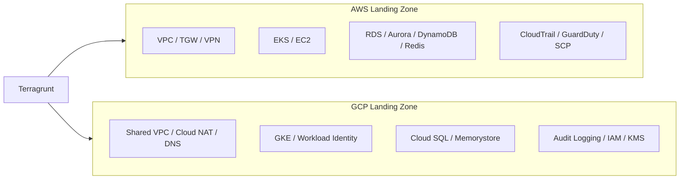

# Multi-Cloud Landing Zone Infrastructure

[](./SECURITY.md)
[](./SECURITY.md)
[](./README.md)
[](./.github/workflows/validate.yml)
[](./LICENSE)

Enterprise-grade, security-hardened multi-cloud landing zone using Terragrunt and Terraform. Supports **AWS** and **GCP** with compliance frameworks including PCI DSS, CIS Benchmarks, and SOC 2.

---

## Table of Contents

- [Quick Start](#quick-start)
- [Architecture](#architecture)
- [Repository Structure](#repository-structure)
- [Prerequisites](#prerequisites)
- [Available Commands](#available-commands)
- [Network Architecture](#network-architecture)
- [Security and Compliance](#security-and-compliance)
- [CI/CD Pipeline](#cicd-pipeline)
- [Configuration Management](#configuration-management)
- [Contributing](#contributing)
- [License](#license)

---

## Quick Start

```bash
git clone https://github.com/cloudon-one/multi-cloud-runway.git
cd multi-cloud-runway

make verify-setup        # Check prerequisites
make init                # Initialize AWS + GCP
make dev-plan            # Plan dev environment
```

---

## Architecture


```mermaid
graph LR
    subgraph AWS["AWS Landing Zone"]
        A1[VPC / TGW / VPN]
        A2[EKS / EC2]
        A3[RDS / Aurora / DynamoDB / Redis]
        A4[CloudTrail / GuardDuty / SCP]
    end

    subgraph GCP["GCP Landing Zone"]
        G1[Shared VPC / Cloud NAT / DNS]
        G2[GKE / Workload Identity]
        G3[Cloud SQL / Memorystore]
        G4[Audit Logging / IAM / KMS]
    end

    TG[Terragrunt] --> AWS
    TG --> GCP
```

### AWS Landing Zone

| Layer | Components |
|-------|-----------|
| **Organization** | Multi-account structure with OUs (Management, Security, Network, Production, Development) |
| **Networking** | VPCs per region/env, Transit Gateway, Site-to-Site VPN |
| **Compute** | EKS clusters, EC2 instances with ASG |
| **Data** | RDS, Aurora, DynamoDB, ElastiCache Redis, S3 |
| **Security** | CloudTrail, GuardDuty, SCPs, IAM roles/groups/policies |
| **Regions** | US (us-east-2), EU (eu-west-2) |

### GCP Landing Zone

| Layer | Components |
|-------|-----------|
| **Organization** | Folder hierarchy (admin, shrd, dev, stg, prod) with Shared VPC |
| **Networking** | Shared VPC host/service projects, Cloud NAT, Cloud DNS, VPC Peering, VPN |
| **Compute** | Private GKE clusters with Workload Identity, multiple node pools |
| **Data** | Cloud SQL (PostgreSQL), Cloud Memorystore (Redis) |
| **Security** | Cloud KMS, IAM permissions, audit logging, firewall rules |
| **Regions** | US (us-east1), EU (europe-west1) |

---

## Repository Structure

```text
.
├── aws-terragrunt-configuration/
│   └── aws/
│       ├── _env.hcl                  # Shared locals for env-pattern configs
│       ├── _module_version.hcl       # Centralized module version (v1.0.0)
│       ├── common.hcl               # Root config: S3 backend, provider, default_tags
│       ├── vars.yaml                # All environment configurations
│       ├── {service}/{region}/{env}/ # Service deployments (vpc, eks, rds, etc.)
│       ├── accounts/                # AWS Organization accounts
│       ├── network/                 # Core networking (VPC, TGW)
│       ├── security/               # SCPs, EventBridge, security SNS
│       └── iam/                    # IAM roles, groups, policies, users
├── gcp-terragrunt-configuration/
│   ├── terragrunt/
│   │   ├── terragrunt.hcl          # Root config: GCS backend
│   │   ├── vars.yaml               # All environment configurations
│   │   └── envs/                   # Environment deployments
│   │       ├── global/             # Admin, audit, IAM, DNS
│   │       ├── shrd/{dev,prod}/    # Shared services
│   │       ├── dev/eu/             # Development
│   │       ├── stg/{eu,us}/        # Staging
│   │       └── prod/{eu,us}/       # Production
│   └── tf-modules/                 # Local Terraform modules (14 modules)
├── scripts/                        # Validation and audit scripts
├── .github/workflows/              # CI/CD pipeline
└── Makefile                        # Infrastructure management commands
```

### Key Design Patterns

| Pattern | AWS | GCP |
|---------|-----|-----|
| **Module Source** | External Git repo with centralized version ref | Local `tf-modules/` directory |
| **State Backend** | S3 + DynamoDB locking | GCS |
| **Config Structure** | `{service}/{region}/{env}/terragrunt.hcl` | `{env}/{region}/{resource}/terragrunt.hcl` |
| **Shared Locals** | `_env.hcl` (55 files), `_module_version.hcl` | Root `terragrunt.hcl` with `include` |
| **Variable Source** | `vars.yaml` with `Environments.{loc}-{env}.Resources` | `vars.yaml` with `envs.{folder}.{env}.resources` |
| **Provider Region** | Auto-selects us-east-2 or eu-west-2 by path | Per-environment in vars.yaml |
| **Default Tags** | Injected via provider `default_tags` | Per-module labels |

---

## Prerequisites

| Tool | Version | Purpose |
|------|---------|---------|
| Terragrunt | >= 1.0.0 | Infrastructure orchestration |
| Terraform / OpenTofu | >= 1.5.0 | Infrastructure provisioning |
| AWS CLI | >= 2.0 | AWS authentication |
| Google Cloud SDK | Latest | GCP authentication |
| pre-commit | Latest | Git hooks |

**Optional:** tfsec, checkov, tflint, infracost, terraform-docs

```bash
# AWS setup
aws configure

# GCP setup
gcloud auth application-default login
```

---

## Available Commands

```bash
# Full workflow
make all                 # init + validate + security + lint + fmt + plan

# Per-cloud operations
make aws-init            # Initialize AWS configs
make aws-validate        # Validate AWS configs
make aws-plan            # Plan AWS changes
make aws-apply           # Apply AWS changes
make gcp-init            # Initialize GCP configs
make gcp-validate        # Validate GCP configs
make gcp-plan            # Plan GCP changes
make gcp-apply           # Apply GCP changes

# Per-environment
make dev-plan            # Plan dev environment
make staging-plan        # Plan staging environment
make prod-plan           # Plan production environment

# Quality & security
make fmt                 # Format HCL/TF files
make lint                # Run tflint
make security            # Run tfsec + checkov
make pre-commit          # Run all pre-commit hooks

# Operations
make health-check        # Verify cloud credentials
make clean               # Remove caches and temp files
make backup-state        # Backup Terraform state files
make cost                # Generate cost estimates (requires infracost)

# Single service (navigate to directory)
cd aws-terragrunt-configuration/aws/eks/us/prod && terragrunt plan
cd gcp-terragrunt-configuration/terragrunt/envs/prod/us/svc-gke && terragrunt plan

# Audit GCP module versions
./scripts/check-module-versions.sh
```

---

## Network Architecture

### AWS

| Component | Details |
|-----------|---------|
| Transit Gateway | Centralized hub connecting all VPCs (US + EU) |
| VPN | Site-to-Site VPN per region/environment |
| VPC Endpoints | Private access to AWS services |
| Provider Regions | `us-east-2` for US, `eu-west-2` for EU (auto-selected by path) |

### GCP

| Environment | VPC CIDR | Region | GKE Pods | GKE Services |
|-------------|----------|--------|----------|---------------|
| Shared Dev | 10.151.0.0/16 | europe-west1 | 10.151.0.0/17 | 10.151.144.0/20 |
| Shared Prod | 10.152.0.0/16 | us-east1 | 10.152.0.0/17 | 10.152.144.0/20 |
| Dev EU | 10.153.0.0/16 | europe-west1 | 10.153.0.0/17 | 10.153.144.0/20 |
| Staging EU | 10.154.0.0/16 | europe-west1 | 10.154.0.0/17 | 10.154.144.0/20 |
| Prod EU | 10.155.0.0/16 | europe-west1 | 10.155.0.0/17 | 10.155.144.0/20 |
| Prod US | 10.156.0.0/16 | us-east1 | 10.156.0.0/17 | 10.156.144.0/20 |

GCP uses **Shared VPC** (host/service project model), **VPC Peering** between shared and environment VPCs, **Cloud NAT** for outbound, and **Cloud DNS** for resolution.

---

## Security and Compliance

### Compliance Frameworks

PCI DSS | CIS Benchmarks | SOC 2 Type II | ISO 27001 | NIST Framework

### Security Controls

| Control | AWS | GCP |
|---------|-----|-----|
| **Network Isolation** | Private subnets, NACLs, SGs | Private GKE, VPC Service Controls |
| **Encryption at Rest** | KMS with auto-rotation | Cloud KMS, CMEK |
| **Encryption in Transit** | TLS 1.2+, ACM certificates | Managed SSL, TLS 1.2+ |
| **Identity** | IAM roles, MFA, cross-account | Workload Identity, groups-based IAM |
| **Audit** | CloudTrail, Config, GuardDuty | Audit logging, Security Command Center |
| **Policy** | SCPs, Config Rules | Organization policies, firewall rules |
| **State Protection** | S3 encryption + DynamoDB locking | GCS encryption + versioning |

### Validation Commands

```bash
make security                                              # tfsec + checkov
python3 scripts/compliance-check.py --framework "PCI DSS"  # Compliance audit
python3 scripts/validate-security-policies.py              # Policy validation
```

---

## CI/CD Pipeline

GitHub Actions workflow (`.github/workflows/validate.yml`) runs on every PR and push to `main`:

| Job | Tool | Scope |
|-----|------|-------|
| terraform-fmt | `terraform fmt` | All `.tf` files |
| tflint | TFLint | GCP tf-modules |
| security-scan | Checkov | Terraform security analysis |
| yaml-lint | yamllint | All YAML files |
| markdown-lint | markdownlint | All Markdown files |
| detect-secrets | detect-secrets | Secret leak prevention |

### Pre-commit Hooks

Locally enforced via `.pre-commit-config.yaml`: terraform_fmt, terraform_validate, terraform_docs, tflint, detect-secrets, checkov, yamllint, markdownlint, conventional commits, terragrunt fmt/validate, security policy checks.

---

## Configuration Management

All environment configuration is centralized in `vars.yaml` files:

- **AWS:** `aws-terragrunt-configuration/aws/vars.yaml` — uses `Environments.{region}-{env}.Resources.{service}`
- **GCP:** `gcp-terragrunt-configuration/terragrunt/vars.yaml` — uses `envs.{folder}.{env}.resources.{service}`

### Module Version Management

- **AWS:** Module version centralized in `_env.hcl` and `_module_version.hcl` (single `module_ref` variable). Change version in 2 files to update all 66 module references.
- **GCP:** Upstream module versions hardcoded per module (Terraform limitation). Audit with `./scripts/check-module-versions.sh`.

### State Management

| | AWS | GCP |
|---|-----|-----|
| **Backend** | S3 | GCS |
| **Locking** | DynamoDB | GCS native |
| **Encryption** | AES-256 | Google-managed |
| **Key Pattern** | `{service}/{region}/{env}/terraform.tfstate` | `{path_relative_to_include}` |

---

## Contributing

See [CONTRIBUTING.md](CONTRIBUTING.md) for full guidelines.

**Branch naming:** `feature/*`, `fix/*`, `docs/*`, `refactor/*`, `compliance/*`

**Commit format:** Conventional commits — `type(scope): description`

Types: `feat`, `fix`, `docs`, `refactor`, `test`, `sec`, `compliance`, `build`, `chore`, `ci`, `perf`, `revert`, `style`

---

## License

MIT License - see [LICENSE](LICENSE) for details.

Developed by [CloudOn.One](https://cloudon-one.com)

### Documentation

| Document | Description |
|----------|-------------|
| [SECURITY.md](SECURITY.md) | Security policies and incident response |
| [CONTRIBUTING.md](CONTRIBUTING.md) | Contribution guidelines |
| [AWS README](aws-terragrunt-configuration/README.md) | AWS-specific documentation |
| [GCP README](gcp-terragrunt-configuration/README.md) | GCP-specific documentation |
