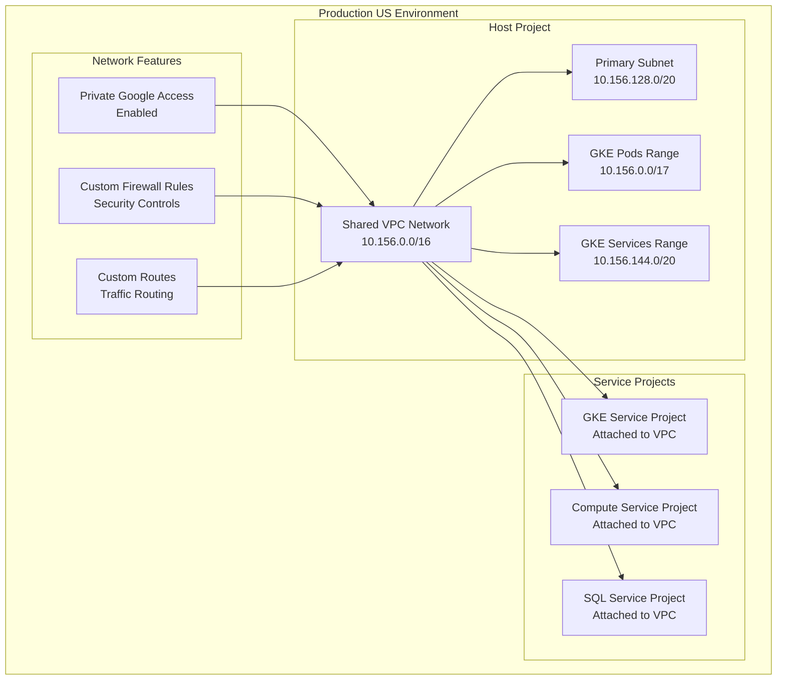

# Shared VPC Network Configuration - Production US

This directory contains the Terragrunt configuration for deploying a production Shared VPC network in the US region.

## Overview

This configuration creates a production-grade Shared VPC network with:

- **Environment**: Production US (`prod/us`)
- **Network Type**: Shared VPC with service project attachments
- **Subnets**: Regional subnets with secondary ranges for GKE
- **Security**: Private Google access, custom firewall rules
- **Integration**: Connected to folder management and service projects

## Architecture



## Dependencies

This configuration depends on the following infrastructure components:

### Required Dependencies

| Dependency | Path | Purpose |
|------------|------|------------|
| `admin` | `../../../global/admin` | Folder and project management |

### Dependency Chain

```
1. global/admin (Folder management)
2. net-vpc (This configuration)
3. svc-projects (Service projects attachment)
4. svc-* (Service-specific resources)
```

## Configuration Details

### Source Module
- **Module**: `terraform-google-svpc`
- **Path**: `../../../../../tf-modules//terraform-google-svpc`
- **Version**: Uses the local tf-modules directory

### Environment Variables
The configuration automatically resolves environment-specific variables:

```hcl
locals {
  environment   = "us"           # From directory structure
  folder        = "prod"         # From directory structure  
  folder_id     = "prod/us"      # Combined identifier
  resource      = "net-vpc"      # From directory name
}
```

### Dynamic Inputs
The configuration merges static YAML configuration with dynamic dependency outputs:

```hcl
inputs = merge(local.resource_vars["inputs"], {
  folder_id   = dependency.admin.outputs.folders["${local.folder_id}"].name
  environment = local.environment
})
```

## Network Design

Based on the production US environment, this network includes:

### Primary Network Range
- **VPC CIDR**: `10.156.0.0/16` (Production US)
- **Region**: `us-east1` (Primary region)

### Subnet Configuration
- **Primary Subnet**: `10.156.128.0/20` (Node IPs)
- **Secondary Ranges**:
  - **Pod Range**: `pods` (`10.156.0.0/17`)
  - **Service Range**: `services` (`10.156.144.0/20`)

### Network Features
- **Private Google Access**: Enabled for all subnets
- **Flow Logs**: Enabled for network monitoring
- **Firewall Rules**: Custom rules for service communication
- **Route Management**: Custom routes for specialized traffic

## Security Configuration

### Network Isolation
- **Host Project Model**: Centralized network management
- **Service Project Isolation**: Workloads in separate projects
- **Firewall Segmentation**: Granular traffic control

### Access Control
- **Private Google Access**: Secure access to Google APIs
- **No External IPs**: Internal communication only
- **VPC Peering**: Controlled inter-network communication

## Deployment Instructions

### Prerequisites

1. **Authentication**: Ensure you have appropriate GCP credentials
```bash
gcloud auth application-default login
```

2. **Dependencies**: Deploy admin infrastructure first
```bash
# Deploy folder management
cd ../../../global/admin
terragrunt apply
```

3. **Permissions**: Verify Shared VPC Admin permissions
```bash
# Check IAM permissions
gcloud projects get-iam-policy PROJECT_ID
```

### Deployment Steps

1. **Initialize Configuration**
```bash
cd gcp-terragrunt-configuration/terragrunt/envs/prod/us/net-vpc
terragrunt init
```

2. **Plan Deployment**
```bash
terragrunt plan
```

3. **Review and Apply**
```bash
terragrunt apply
```

4. **Verify Network Creation**
```bash
# List VPC networks
gcloud compute networks list --project=$(terragrunt output project_id)

# Check subnets
gcloud compute networks subnets list --project=$(terragrunt output project_id)
```

## Outputs

After successful deployment, this configuration provides:

| Output | Description |
|--------|-------------|
| `network_name` | VPC network name |
| `network_self_link` | Full network resource URL |
| `project_id` | Host project ID |
| `subnets` | Map of all created subnets |

## Service Project Attachment

### Attaching Service Projects
```bash
# Enable service project attachment
gcloud compute shared-vpc associated-projects add SERVICE_PROJECT_ID \
    --host-project=HOST_PROJECT_ID
```

### Subnet IAM Permissions
```bash
# Grant subnet user permissions
gcloud projects add-iam-policy-binding HOST_PROJECT_ID \
    --member="serviceAccount:SERVICE_ACCOUNT@SERVICE_PROJECT_ID.iam.gserviceaccount.com" \
    --role="roles/compute.networkUser"
```

## Monitoring and Operations

### Health Checks
```bash
# Check VPC status
gcloud compute networks describe NETWORK_NAME --project=HOST_PROJECT_ID

# Verify firewall rules
gcloud compute firewall-rules list --project=HOST_PROJECT_ID

# Check subnet utilization
gcloud compute networks subnets describe SUBNET_NAME \
    --region=us-east1 --project=HOST_PROJECT_ID
```

### Common Operations

#### Adding New Subnets
```bash
# Add subnet to existing VPC
gcloud compute networks subnets create NEW_SUBNET_NAME \
    --network=NETWORK_NAME \
    --region=us-central1 \
    --range=10.156.160.0/20 \
    --project=HOST_PROJECT_ID
```

#### Firewall Rule Management
```bash
# List all firewall rules
gcloud compute firewall-rules list --project=HOST_PROJECT_ID

# Create custom firewall rule
gcloud compute firewall-rules create allow-internal \
    --network=NETWORK_NAME \
    --allow=tcp,udp,icmp \
    --source-ranges=10.156.0.0/16 \
    --project=HOST_PROJECT_ID
```

## Troubleshooting

### Common Issues

#### Quota Exceeded
```
Error: Quota 'NETWORKS' exceeded
```
**Solution**: Request quota increase for VPC networks in the region

#### Subnet CIDR Conflicts
```
Error: Subnet range conflicts with existing subnet
```
**Solution**: Verify CIDR ranges don't overlap with existing subnets

#### Service Project Attachment Failures
```
Error: Failed to attach service project
```
**Solution**: Verify IAM permissions for Shared VPC Admin role

### Debugging Commands

```bash
# Check Terragrunt configuration
terragrunt plan --terragrunt-log-level=debug

# Verify dependencies
terragrunt graph-dependencies

# Check network connectivity
gcloud compute networks subnets describe SUBNET_NAME \
    --region=us-east1 --project=HOST_PROJECT_ID
```

## Security Considerations

### Production Security Checklist
- [ ] Private Google Access enabled for all subnets
- [ ] No default internet gateway for private subnets
- [ ] Custom firewall rules implemented
- [ ] VPC Flow Logs enabled for monitoring
- [ ] Service project isolation configured
- [ ] Network monitoring and alerting set up

### Network Segmentation
- Implement least privilege firewall rules
- Use network tags for granular control
- Regular security audit of network access
- Monitor unusual traffic patterns

## Maintenance

### Regular Tasks
- Review and update firewall rules
- Monitor subnet utilization and plan expansion
- Update network security policies
- Validate service project attachments

### Capacity Planning
- Monitor IP address utilization per subnet
- Plan secondary range expansion for GKE growth
- Review cross-region connectivity requirements

## Related Documentation

- [Shared VPC Module](../../../../../tf-modules/terraform-google-svpc/README.md)
- [Admin Configuration](../../../global/admin/README.md)
- [Service Projects](../svc-projects/README.md)
- [GKE Configuration](../svc-gke/README.md)

---

**⚠️ Production Network**: This configuration manages critical network infrastructure. All changes should be thoroughly tested and coordinated with dependent services.