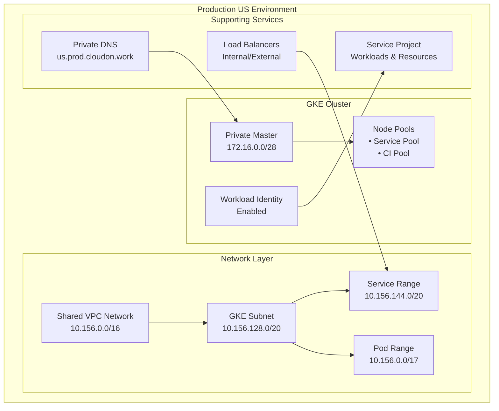

# GKE Cluster Configuration - Production US

This directory contains the Terragrunt configuration for deploying a production Google Kubernetes Engine (GKE) cluster in the US region.

## Overview

This configuration creates a production-grade GKE cluster with:

- **Environment**: Production US (`prod/us`)
- **Cluster Type**: Private GKE cluster with Workload Identity
- **Node Pools**: Multiple pools for different workload types
- **Security**: Private nodes, authorized networks, network policies
- **Integration**: Connected to shared VPC and service projects

## Architecture



## Dependencies

This configuration depends on the following infrastructure components:

### Required Dependencies

| Dependency | Path | Purpose |
|------------|------|---------|
| `host_project` | `../net-vpc` | VPC network and subnets |
| `gke_project` | `../svc-projects` | Service project for GKE resources |

### Dependency Chain

```
1. net-vpc (VPC and networking)
2. svc-projects (Service project creation)  
3. svc-gke (This configuration)
```

## Configuration Details

### Source Module
- **Module**: `terraform-google-gke`
- **Path**: `../../../../../tf-modules//terraform-google-gke`
- **Version**: Uses the local tf-modules directory

### Environment Variables
The configuration automatically resolves environment-specific variables:

```hcl
locals {
  environment   = "us"           # From directory structure
  folder        = "prod"         # From directory structure  
  folder_id     = "prod/us"      # Combined identifier
  resource      = "svc-gke"      # From directory name
}
```

### Dynamic Inputs
The configuration merges static YAML configuration with dynamic dependency outputs:

```hcl
inputs = merge(local.resource_vars["inputs"], {
  project_id         = dependency.gke_project.outputs.projects["service"].project_id
  region             = dependency.host_project.outputs.subnets["$REGION/$SUBNET"].region
  network            = dependency.host_project.outputs.network_name
  network_project_id = dependency.host_project.outputs.project_id
  subnetwork         = dependency.host_project.outputs.subnets["$REGION/$SUBNET"].name
  identity_namespace = "${dependency.gke_project.outputs.projects["service"].project_id}.svc.id.goog"
})
```

## Configuration Source

The cluster configuration is defined in `/terragrunt/vars.yaml` under:
```yaml
envs:
  prod:
    us:
      resources:
        svc-gke:
          inputs:
            # GKE configuration parameters
```

### Key Configuration Parameters

Based on the vars.yaml structure, this cluster includes:

- **Cluster Name**: `cloudon-prod-us-cluster`
- **Master CIDR**: `10.156.160.0/28`
- **IP Ranges**: 
  - Pods: `pods` (secondary range)
  - Services: `services` (secondary range)
- **Features**:
  - HTTP Load Balancing: Enabled
  - Horizontal Pod Autoscaling: Enabled
  - Network Policy: Enabled (Calico)
  - Private Nodes: Enabled
  - Database Encryption: Enabled
  - Workload Identity: Enabled

### Node Pools Configuration

#### Service Node Pool
- **Purpose**: Primary application workloads
- **Machine Type**: `n2-standard-4`
- **Scaling**: Min 3, Max 5 nodes
- **Storage**: 100GB SSD persistent disks
- **Features**: Auto-repair, auto-upgrade enabled

#### CI Pool
- **Purpose**: Continuous integration workloads
- **Machine Type**: `n2-standard-2`
- **Scaling**: Min 1, Max 5 nodes
- **Features**: Dedicated for CI/CD pipelines

## Security Configuration

### Network Security
- **Private Cluster**: Nodes have no external IPs
- **Private Endpoint**: Master endpoint accessible only from authorized networks
- **Master Authorized Networks**:
  - VPC CIDR: `10.156.0.0/16` (Prod US VPC)
  - Shared VPC: `10.152.0.0/16` (Shared Prod VPC)

### Access Control
- **Workload Identity**: Enabled for secure pod-to-GCP authentication
- **Service Accounts**: Dedicated service accounts per workload
- **RBAC**: Kubernetes role-based access control
- **Network Policies**: Calico-based pod-to-pod communication control

### Data Protection
- **Database Encryption**: etcd encrypted with Cloud KMS
- **Node Security**: Container-Optimized OS with security patches
- **Image Security**: Private container registry integration

## Deployment Instructions

### Prerequisites

1. **Authentication**: Ensure you have appropriate GCP credentials
```bash
gcloud auth application-default login
```

2. **Dependencies**: Deploy required infrastructure first
```bash
# Deploy VPC infrastructure
cd ../net-vpc
terragrunt apply

# Deploy service projects
cd ../svc-projects  
terragrunt apply
```

3. **Tools**: Install required tools
```bash
# Terragrunt >= 0.60.0
# Terraform >= 1.5.0
# kubectl for cluster access
```

### Deployment Steps

1. **Initialize Configuration**
```bash
cd gcp-terragrunt-configuration/terragrunt/envs/prod/us/svc-gke
terragrunt init
```

2. **Plan Deployment**
```bash
terragrunt plan
```

3. **Review and Apply**
```bash
terragrunt apply
```

4. **Configure kubectl Access**
```bash
# Get cluster credentials
gcloud container clusters get-credentials cloudon-prod-us-cluster \
    --region=us-east1 \
    --project=$(terragrunt output project_id)

# Verify connectivity
kubectl get nodes
```

## Outputs

After successful deployment, this configuration provides:

| Output | Description |
|--------|-------------|
| `cluster_id` | Full cluster identifier |
| `cluster_name` | Cluster display name |
| `cluster_endpoint` | Kubernetes API endpoint |
| `cluster_ca_certificate` | Base64-encoded CA certificate |
| `location` | Cluster region/zone |

## Monitoring and Operations

### Health Checks
```bash
# Check cluster status
gcloud container clusters describe cloudon-prod-us-cluster --region=us-east1

# Check node pools
gcloud container node-pools list --cluster=cloudon-prod-us-cluster --region=us-east1

# Verify workload identity
kubectl get serviceaccounts -A
```

### Common Operations

#### Scaling Node Pools
```bash
# Scale service node pool
gcloud container clusters resize cloudon-prod-us-cluster \
    --node-pool=service-node-pool \
    --num-nodes=5 \
    --region=us-east1
```

#### Cluster Upgrades
```bash
# Check available versions
gcloud container get-server-config --region=us-east1

# Upgrade cluster (master first, then nodes)
gcloud container clusters upgrade cloudon-prod-us-cluster --region=us-east1
```

### Workload Deployment Example

```yaml
apiVersion: apps/v1
kind: Deployment
metadata:
  name: sample-app
  namespace: default
spec:
  replicas: 3
  selector:
    matchLabels:
      app: sample-app
  template:
    metadata:
      labels:
        app: sample-app
    spec:
      serviceAccountName: sample-app-ksa  # Workload Identity enabled
      nodeSelector:
        cloud.google.com/gke-nodepool: service-node-pool
      containers:
      - name: app
        image: gcr.io/PROJECT_ID/sample-app:latest
        resources:
          requests:
            memory: "256Mi"
            cpu: "250m"
          limits:
            memory: "512Mi"
            cpu: "500m"
```

## Troubleshooting

### Common Issues

#### Dependency Resolution Errors
```
Error: Failed to read outputs from dependency
```
**Solution**: Ensure dependent modules are applied first:
```bash
cd ../net-vpc && terragrunt apply
cd ../svc-projects && terragrunt apply
```

#### Network Connectivity Issues
```
Error: Unable to connect to the server
```
**Solution**: Check authorized networks configuration and VPN connectivity

#### Workload Identity Issues
```
Error: pods is forbidden
```
**Solution**: Verify service account bindings and Kubernetes RBAC

### Debugging Commands

```bash
# Check Terragrunt configuration
terragrunt plan --terragrunt-log-level=debug

# Verify dependencies
terragrunt graph-dependencies

# Check GKE cluster logs
gcloud logging read 'resource.type="gke_cluster"' --limit=50

# Network connectivity test
kubectl run debug --image=nicolaka/netshoot -it --rm -- /bin/bash
```

## Security Considerations

### Production Security Checklist
- [ ] Private nodes enabled (no external IPs)
- [ ] Private endpoint configured with authorized networks
- [ ] Workload Identity enabled and configured
- [ ] Network policies implemented
- [ ] Database encryption enabled with KMS
- [ ] Binary Authorization configured for image security
- [ ] Monitoring and alerting configured
- [ ] Backup strategy implemented for stateful workloads

### Access Management
- Limit cluster admin access to essential personnel
- Use Workload Identity instead of service account keys
- Implement least privilege RBAC policies
- Regular access reviews and audit logging

## Maintenance

### Regular Tasks
- Monitor cluster resource utilization
- Review and apply security patches
- Update node pool configurations as needed
- Backup and test disaster recovery procedures
- Cost optimization reviews

### Upgrade Strategy
1. Test upgrades in development environment first
2. Upgrade master during maintenance window
3. Upgrade node pools with rolling updates
4. Validate application functionality after upgrades

## Related Documentation

- [Terraform Google GKE Module](../../../../../tf-modules/terraform-google-gke/README.md)
- [Network Configuration](../net-vpc/README.md)
- [Service Projects](../svc-projects/README.md)
- [GCP GKE Documentation](../../../README.md)

---

**⚠️ Production Environment**: This configuration manages production infrastructure. All changes should be thoroughly tested in development environments before applying to production.