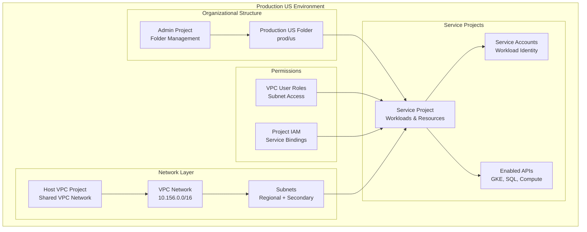

# Service Projects Configuration - Production US

This directory contains the Terragrunt configuration for creating and managing service projects in the production US environment.

## Overview

This configuration creates production-grade service projects with:

- **Environment**: Production US (`prod/us`)
- **Project Type**: Service projects attached to Shared VPC
- **Integration**: Connected to folder management and VPC network
- **Services**: GKE, SQL, Compute, and other Google Cloud services
- **Security**: IAM bindings, API enablement, and service accounts

## Architecture



## Dependencies

This configuration depends on the following infrastructure components:

### Required Dependencies

| Dependency | Path | Purpose |
|------------|------|---------|
| `admin` | `../../../global/admin` | Folder and organizational management |
| `net-vpc` | `../net-vpc` | Shared VPC network and subnets |

### Dependency Chain

```
1. global/admin (Folder management)
2. net-vpc (VPC network creation)
3. svc-projects (This configuration)
4. svc-* (Service-specific deployments)
```

## Configuration Details

### Source Module
- **Module**: `terraform-google-projects`
- **Path**: `../../../../../tf-modules//terraform-google-projects`
- **Version**: Uses the local tf-modules directory

### Environment Variables
The configuration automatically resolves environment-specific variables:

```hcl
locals {
  environment   = "us"           # From directory structure
  folder        = "prod"         # From directory structure  
  folder_id     = "prod/us"      # Combined identifier
  resource      = "svc-projects" # From directory name
}
```

### Dynamic Service Project Configuration
The configuration creates service projects with Shared VPC attachment:

```hcl
service_projects = {
  service = merge(local.resource_vars["inputs"]["service_projects"]["service"], {
    folder_id            = dependency.admin.outputs.folders["${local.folder_id}"].name
    shared_vpc_host_name = dependency.net-vpc.outputs.project_id
    shared_vpc_subnets   = dependency.net-vpc.outputs.subnets_self_links
  })
}
```

## Service Project Features

Based on the production US configuration, service projects include:

### Project Configuration
- **Project Name**: Environment and region-specific naming
- **Folder Placement**: Organized under production folder structure
- **Billing Account**: Connected to organizational billing
- **Labels**: Environment, region, and purpose tagging

### API Enablement
Core Google Cloud APIs enabled:
- **Kubernetes Engine API**: For GKE cluster management
- **Cloud SQL Admin API**: For database services
- **Compute Engine API**: For VM and networking
- **Container Registry API**: For container image storage
- **Cloud Resource Manager API**: For project management
- **IAM Service Account Credentials API**: For workload identity

### Shared VPC Integration
- **VPC Attachment**: Automatic attachment to host VPC project
- **Subnet Access**: Service accounts granted network user permissions
- **Network Isolation**: Secure communication within shared network

## Security Configuration

### IAM and Service Accounts
- **Default Service Accounts**: Configured with minimal permissions
- **Custom Service Accounts**: Created for specific workloads
- **Workload Identity**: Enabled for Kubernetes service accounts
- **Cross-Project Permissions**: Minimal required access

### Network Security
- **Shared VPC Model**: Centralized network security controls
- **Private Subnets**: No direct internet access by default
- **Service-to-Service Communication**: Controlled via firewall rules

## Deployment Instructions

### Prerequisites

1. **Authentication**: Ensure you have appropriate GCP credentials
```bash
gcloud auth application-default login
```

2. **Dependencies**: Deploy required infrastructure first
```bash
# Deploy admin folder structure
cd ../../../global/admin
terragrunt apply

# Deploy VPC network
cd ../net-vpc
terragrunt apply
```

3. **Permissions**: Verify project creation permissions
```bash
# Check organization-level IAM
gcloud organizations get-iam-policy ORGANIZATION_ID
```

### Deployment Steps

1. **Initialize Configuration**
```bash
cd gcp-terragrunt-configuration/terragrunt/envs/prod/us/svc-projects
terragrunt init
```

2. **Plan Deployment**
```bash
terragrunt plan
```

3. **Review and Apply**
```bash
terragrunt apply
```

4. **Verify Project Creation**
```bash
# List created projects
gcloud projects list --filter="parent.id:FOLDER_ID"

# Check Shared VPC attachment
gcloud compute shared-vpc associated-projects list HOST_PROJECT_ID
```

## Outputs

After successful deployment, this configuration provides:

| Output | Description |
|--------|-------------|
| `projects` | Map of all created service projects |
| `service_accounts` | Service accounts created per project |
| `project_numbers` | Numeric project IDs for API calls |

## Service Project Usage

### Deploying Resources
```bash
# Set project context for subsequent resources
export PROJECT_ID=$(terragrunt output -raw projects.service.project_id)

# Deploy service-specific resources
cd ../svc-gke
terragrunt apply
```

### Managing Service Accounts
```bash
# List service accounts in service project
gcloud iam service-accounts list --project=$PROJECT_ID

# Create workload identity binding
gcloud iam service-accounts add-iam-policy-binding \
    --project=$PROJECT_ID \
    --role=roles/iam.workloadIdentityUser \
    --member="serviceAccount:$PROJECT_ID.svc.id.goog[NAMESPACE/SERVICE_ACCOUNT]" \
    SERVICE_ACCOUNT@$PROJECT_ID.iam.gserviceaccount.com
```

## Monitoring and Operations

### Health Checks
```bash
# Check project status
gcloud projects describe PROJECT_ID

# Verify API enablement
gcloud services list --enabled --project=PROJECT_ID

# Check Shared VPC attachment status
gcloud compute shared-vpc get-host-project PROJECT_ID
```

### Common Operations

#### Adding New APIs
```bash
# Enable additional APIs
gcloud services enable container.googleapis.com --project=PROJECT_ID
gcloud services enable cloudsql.googleapis.com --project=PROJECT_ID
```

#### Managing Project IAM
```bash
# Add IAM policy binding
gcloud projects add-iam-policy-binding PROJECT_ID \
    --member="user:admin@example.com" \
    --role="roles/editor"

# List current IAM policies
gcloud projects get-iam-policy PROJECT_ID
```

## Troubleshooting

### Common Issues

#### Project Creation Quota Exceeded
```
Error: Project creation quota exceeded
```
**Solution**: Request quota increase for project creation in the organization

#### Shared VPC Attachment Failures
```
Error: Failed to attach project to Shared VPC
```
**Solution**: Verify Shared VPC Admin permissions and host project existence

#### API Enablement Failures
```
Error: Failed to enable API
```
**Solution**: Check billing account attachment and API availability in region

### Debugging Commands

```bash
# Check Terragrunt configuration
terragrunt plan --terragrunt-log-level=debug

# Verify dependencies
terragrunt graph-dependencies

# Check project creation status
gcloud projects list --filter="lifecycleState:ACTIVE"
```

## Security Considerations

### Production Security Checklist
- [ ] Service projects created under appropriate folder structure
- [ ] Minimal IAM permissions granted to service accounts
- [ ] Shared VPC properly configured for network isolation
- [ ] Required APIs enabled with least privilege access
- [ ] Workload Identity configured for Kubernetes workloads
- [ ] Project-level audit logging enabled

### Access Management
- Use service-specific service accounts instead of default accounts
- Implement workload identity for Kubernetes applications
- Regular audit of project-level IAM bindings
- Monitor cross-project resource access

## Maintenance

### Regular Tasks
- Review and audit IAM bindings across service projects
- Monitor API usage and costs per service project
- Update project labels and metadata as needed
- Validate Shared VPC attachment status

### Cost Management
- Set up billing alerts per service project
- Monitor resource usage and implement cost controls
- Regular cleanup of unused resources
- Optimize API usage and quotas

## Related Documentation

- [Projects Module](../../../../../tf-modules/terraform-google-projects/README.md)
- [Admin Configuration](../../../global/admin/README.md)
- [VPC Network](../net-vpc/README.md)
- [GKE Configuration](../svc-gke/README.md)

---

**⚠️ Production Service Projects**: This configuration manages critical project infrastructure. Changes affect all services deployed within these projects.