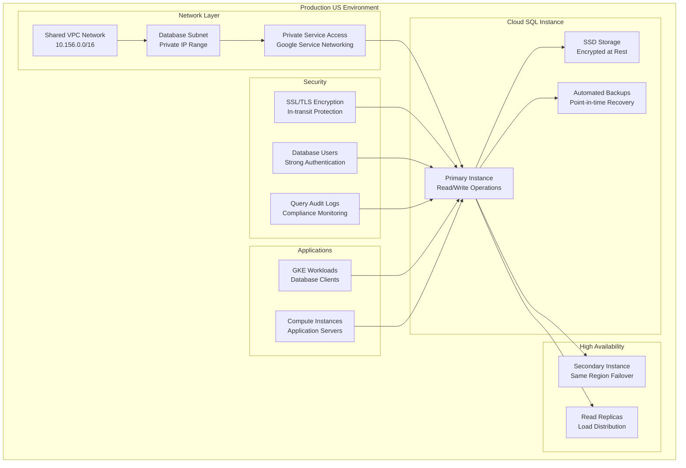

# Cloud SQL Database Configuration - Production US

This directory contains the Terragrunt configuration for deploying production Cloud SQL databases in the US region.

## Overview

This configuration creates a production-grade Cloud SQL instance with:

- **Environment**: Production US (`prod/us`)
- **Database Type**: PostgreSQL/MySQL with private IP connectivity
- **High Availability**: Regional persistence with automatic failover
- **Security**: Private network access, SSL enforcement, database encryption
- **Integration**: Connected to Shared VPC and service projects

## Architecture



## Dependencies

This configuration depends on the following infrastructure components:

### Required Dependencies

| Dependency | Path | Purpose |
|------------|------|---------|
| `host_project` | `../net-vpc` | Shared VPC network for private connectivity |
| `sql_project` | `../svc-projects` | Service project for Cloud SQL resources |

### Dependency Chain

```
1. global/admin (Folder management)
2. net-vpc (VPC network and private service access)
3. svc-projects (Service project creation)
4. svc-sql (This configuration)
```

## Configuration Details

### Source Module
- **Module**: `terraform-google-sql`
- **Path**: `../../../../../tf-modules//terraform-google-sql`
- **Version**: Uses the local tf-modules directory

### Environment Variables
The configuration automatically resolves environment-specific variables:

```hcl
locals {
  environment   = "us"           # From directory structure
  folder        = "prod"         # From directory structure  
  folder_id     = "prod/us"      # Combined identifier
  resource      = "svc-sql"      # From directory name
}
```

### Dynamic Configuration
The configuration merges static YAML configuration with dependency outputs:

```hcl
inputs = merge(local.resource_vars["inputs"], {
  project_id         = dependency.sql_project.outputs.projects["service"].project_id
  region             = dependency.host_project.outputs.subnets["$REGION/$SUBNET"].region
  vpc_network        = dependency.host_project.outputs.network_name
  network_project_id = dependency.host_project.outputs.project_id
  ip_configuration = merge(local.resource_vars["inputs"]["ip_configuration"], {
    private_network = dependency.host_project.outputs.network_self_link
  })
})
```

## Database Configuration

Based on the production US environment, this database includes:

### Instance Configuration
- **Database Engine**: PostgreSQL 14 (or MySQL 8.0)
- **Machine Type**: High-memory instances for production workloads
- **Availability**: Regional (REGIONAL) for automatic failover
- **Storage**: SSD persistent disks with automatic resize
- **Location**: `us-east1` region for low latency

### Network Security
- **Private IP Only**: No public IP address exposure
- **VPC Integration**: Connected to Shared VPC via private service access
- **SSL Enforcement**: Required encrypted connections
- **Authorized Networks**: VPC CIDR ranges only

### Backup and Recovery
- **Automated Backups**: Daily backups with configurable timing
- **Point-in-time Recovery**: Restore to any second within retention period
- **Backup Location**: Cross-region for disaster recovery
- **Retention Policy**: 30 days for production compliance

## Security Configuration

### Network Security
- **Private Connectivity**: Database accessible only within VPC
- **No Public IP**: Prevents direct internet access
- **VPC Firewall Rules**: Additional network-level protection
- **Private Service Access**: Secure Google service networking

### Database Security
- **SSL/TLS Encryption**: Required for all connections
- **Database Authentication**: Strong password policies
- **User Management**: Least privilege access principles
- **Audit Logging**: Query and connection logging enabled

### Data Protection
- **Encryption at Rest**: Google-managed encryption keys
- **Encryption in Transit**: SSL/TLS for client connections
- **Backup Encryption**: Encrypted backup storage
- **Point-in-time Recovery**: Data recovery capabilities

## Deployment Instructions

### Prerequisites

1. **Authentication**: Ensure you have appropriate GCP credentials
```bash
gcloud auth application-default login
```

2. **Dependencies**: Deploy required infrastructure first
```bash
# Deploy VPC network
cd ../net-vpc
terragrunt apply

# Deploy service projects
cd ../svc-projects
terragrunt apply
```

3. **Network Preparation**: Verify private service access
```bash
# Check private service connection
gcloud compute addresses list --global --project=HOST_PROJECT_ID
gcloud services vpc-peerings list --network=VPC_NETWORK --project=HOST_PROJECT_ID
```

### Deployment Steps

1. **Initialize Configuration**
```bash
cd gcp-terragrunt-configuration/terragrunt/envs/prod/us/svc-sql
terragrunt init
```

2. **Plan Deployment**
```bash
terragrunt plan
```

3. **Review and Apply**
```bash
terragrunt apply
```

4. **Verify Database Creation**
```bash
# Check instance status
gcloud sql instances describe INSTANCE_NAME --project=PROJECT_ID

# Test connectivity from VPC
gcloud sql connect INSTANCE_NAME --user=USERNAME --project=PROJECT_ID
```

## Outputs

After successful deployment, this configuration provides:

| Output | Description |
|--------|-------------|
| `instance_name` | Cloud SQL instance identifier |
| `instance_connection_name` | Connection string for Cloud SQL Proxy |
| `private_ip_address` | Private IP for VPC connections |
| `server_ca_cert` | Server certificate for SSL connections |

## Database Access Patterns

### From GKE Workloads
```yaml
# Using Cloud SQL Proxy sidecar
apiVersion: apps/v1
kind: Deployment
metadata:
  name: app-with-db
spec:
  template:
    spec:
      containers:
      - name: app
        image: gcr.io/PROJECT_ID/app:latest
        env:
        - name: DB_HOST
          value: "127.0.0.1"
        - name: DB_PORT
          value: "5432"
      - name: cloudsql-proxy
        image: gcr.io/cloudsql-docker/gce-proxy:latest
        command:
          - "/cloud_sql_proxy"
          - "-instances=PROJECT_ID:REGION:INSTANCE=tcp:5432"
```

### From Compute Instances
```bash
# Direct private IP connection
psql "host=PRIVATE_IP port=5432 sslmode=require user=USERNAME dbname=DATABASE"

# Using Cloud SQL Proxy
./cloud_sql_proxy -instances=PROJECT_ID:REGION:INSTANCE=tcp:5432 &
psql "host=127.0.0.1 port=5432 sslmode=require user=USERNAME dbname=DATABASE"
```

## Monitoring and Operations

### Health Checks
```bash
# Check instance status
gcloud sql instances describe INSTANCE_NAME --project=PROJECT_ID

# Monitor database metrics
gcloud sql instances describe INSTANCE_NAME --project=PROJECT_ID --format="table(state,backendType,databaseVersion)"

# Check backup status
gcloud sql backups list --instance=INSTANCE_NAME --project=PROJECT_ID
```

### Performance Monitoring
```bash
# View database flags
gcloud sql instances describe INSTANCE_NAME --project=PROJECT_ID --format="table(settings.databaseFlags[])"

# Check connection count
gcloud logging read 'resource.type="cloudsql_database" AND protoPayload.methodName="cloudsql.instances.connect"' --limit=10
```

## Troubleshooting

### Common Issues

#### Private IP Connection Failures
```
Error: could not connect to server: Connection timed out
```
**Solution**: 
- Verify private service access is configured
- Check VPC firewall rules allow database port (5432/3306)
- Confirm client is within authorized VPC network

#### SSL Connection Requirements
```
Error: connection requires SSL
```
**Solution**:
- Download SSL certificates from Cloud SQL instance
- Configure client with SSL parameters
- Verify `require_ssl` setting matches client configuration

#### Backup/Recovery Issues
```
Error: backup operation failed
```
**Solution**:
- Check service account permissions for backup operations
- Verify backup configuration settings
- Review audit logs for specific error details

### Debugging Commands

```bash
# Check Terragrunt configuration
terragrunt plan --terragrunt-log-level=debug

# Verify network connectivity
gcloud compute instances create test-vm --subnet=SUBNET_NAME --project=PROJECT_ID
gcloud compute ssh test-vm --project=PROJECT_ID

# Test database connectivity
telnet PRIVATE_IP 5432
```

## Disaster Recovery

### Cross-Region Read Replicas
```bash
# Create read replica in different region
gcloud sql instances create REPLICA_NAME \
    --master-instance-name=INSTANCE_NAME \
    --tier=MACHINE_TYPE \
    --region=us-west1 \
    --project=PROJECT_ID
```

### Backup and Restore Procedures
```bash
# Create on-demand backup
gcloud sql backups create --instance=INSTANCE_NAME --project=PROJECT_ID

# Restore from backup
gcloud sql backups restore BACKUP_ID --restore-instance=NEW_INSTANCE_NAME --project=PROJECT_ID

# Export database
gcloud sql export sql INSTANCE_NAME gs://BUCKET/database-export.sql \
    --database=DATABASE_NAME --project=PROJECT_ID
```

## Security Considerations

### Production Security Checklist
- [ ] Private IP only (no public IP)
- [ ] SSL/TLS encryption enforced
- [ ] Strong database user passwords
- [ ] Network-level access controls
- [ ] Backup encryption enabled
- [ ] Audit logging configured
- [ ] High availability enabled
- [ ] Point-in-time recovery enabled

### Compliance Requirements
- **Data Encryption**: At-rest and in-transit encryption
- **Access Logging**: Database query and connection auditing  
- **Backup Retention**: Meet regulatory requirements
- **Network Isolation**: VPC-only access with firewall controls

## Maintenance

### Regular Tasks
- Monitor database performance metrics
- Review and rotate database user passwords
- Test backup and recovery procedures
- Update database engine versions during maintenance windows
- Monitor storage utilization and optimize queries

### Cost Optimization
- Right-size instances based on utilization metrics
- Use committed use discounts for predictable workloads
- Implement automatic storage cleanup policies
- Monitor backup retention and adjust as needed

## Related Documentation

- [Cloud SQL Module](../../../../../tf-modules/terraform-google-sql/README.md)
- [VPC Network Configuration](../net-vpc/README.md)
- [Service Projects Configuration](../svc-projects/README.md)
- [GKE Integration](../svc-gke/README.md)

---

**⚠️ Production Database**: This configuration manages critical data infrastructure. Always test changes in development environments and ensure proper backup procedures before applying to production.