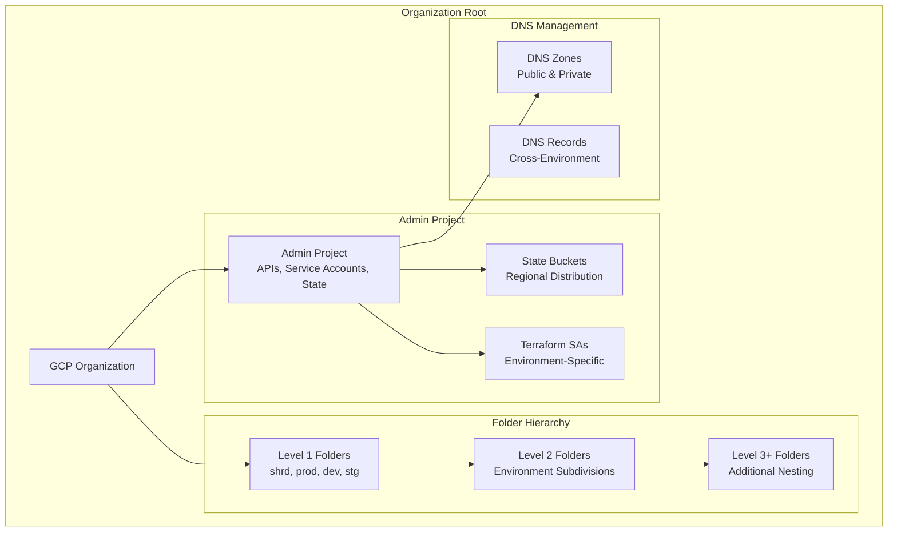

# Terraform Google Admin Module

This module creates and manages the Google Cloud administrative infrastructure including organization folders, projects, service accounts, and state storage buckets.

## Overview

The admin module is the foundation of the GCP landing zone setup and should be deployed first. It creates:

- **Organizational Structure**: Multi-level folder hierarchy (up to 5 levels)
- **Admin Project**: Central administration project with required APIs
- **Service Accounts**: Terraform service accounts for each environment
- **State Storage**: GCS buckets for Terraform state management
- **DNS Management**: Optional DNS zones and records
- **IAM Bindings**: Service account permissions and bindings

## Usage

```hcl
module "admin" {
  source = "./tf-modules/terraform-google-admin"

  # Required Variables
  billing_account    = "012345-678901-234567"
  domain            = "example.com"
  admin_state_bucket = "admin-terraform-state"

  # Optional Variables
  admin_project_name = "gcp-admin"
  admin_folder       = true
  org_id            = "123456789012"
  
  # Folder Structure
  folders = {
    level1 = ["shrd", "prod", "dev", "stg"]
    level2 = [
      { name = "prod", parent = "shrd" },
      { name = "dev", parent = "shrd" }
    ]
    level3 = []
    level4 = []
    level5 = []
  }
  
  # Terraform Service Accounts
  terraform_service_accounts = [
    "tf-admin",
    "tf-dev",
    "tf-prod", 
    "tf-shrd"
  ]
  
  # Environment State Buckets
  environment_state_buckets = {
    admin     = "us-east1"
    dev-eu    = "europe-west1"
    prod-us   = "us-east1"
    prod-eu   = "europe-west1"
  }
}
```

## Architecture



## Resources Created

### Core Infrastructure
- **google_project**: Admin project with required APIs enabled
- **google_folder**: Hierarchical folder structure (up to 5 levels)
- **google_service_account**: Terraform service accounts per environment
- **google_storage_bucket**: Regional state storage buckets
- **google_project_iam_binding**: Service account permissions

### APIs Enabled
- `cloudresourcemanager.googleapis.com`
- `serviceusage.googleapis.com`
- `iam.googleapis.com`
- `cloudbilling.googleapis.com`
- `storage.googleapis.com`
- `dns.googleapis.com`

### DNS (Optional)
- **google_dns_managed_zone**: Public/private DNS zones
- **google_dns_record_set**: Cross-environment DNS records

## Variables

### Required Variables

| Name | Description | Type | 
|------|-------------|------|
| `billing_account` | GCP Billing Account ID | `string` |
| `domain` | Organization domain name | `string` |
| `admin_state_bucket` | GCS bucket name for admin state | `string` |

### Important Variables

| Name | Description | Type | Default |
|------|-------------|------|---------|
| `admin_project_name` | Admin project display name | `string` | `"administration"` |
| `admin_random_project_id` | Add random suffix to project ID | `bool` | `true` |
| `admin_folder` | Whether to create admin folder | `bool` | `true` |
| `folders` | Folder hierarchy configuration | `object` | See below |
| `terraform_service_accounts` | List of service account names | `list(string)` | `[]` |
| `environment_state_buckets` | State bucket configuration | `map(string)` | `{}` |

### Folder Structure Configuration

```hcl
folders = {
  level1 = ["shrd", "prod", "dev", "stg"]
  level2 = [
    { name = "prod", parent = "shrd" },
    { name = "dev", parent = "shrd" },
    { name = "eu", parent = "prod" },
    { name = "us", parent = "prod" }
  ]
  level3 = []  # Additional nesting as needed
  level4 = []
  level5 = []
}
```

### DNS Configuration (Optional)

| Name | Description | Type | Default |
|------|-------------|------|---------|
| `net_dns` | DNS zone configuration | `object` | See example |

```hcl
net_dns = {
  inputs = {
    project_id = "admin-project-id"
    name       = "main-zone"
    type       = "public"
    domain     = "example.com."
    recordsets = [
      {
        name    = "dev.example.com"
        type    = "NS"
        ttl     = 300
        records = ["ns1.google.com.", "ns2.google.com."]
      }
    ]
  }
}
```

## Outputs

| Name | Description |
|------|-------------|
| `admin_project_id` | The admin project ID |
| `admin_project_number` | The admin project number |
| `terraform_service_accounts` | Map of created service accounts |
| `state_buckets` | Map of created state storage buckets |
| `folders` | Map of created folders by level |
| `dns_zone_name` | DNS zone name (if created) |

## Dependencies

### Terraform Providers
- `google` >= 4.0
- `google-beta` >= 4.0
- `random` >= 3.0

### External Dependencies
- Valid GCP organization with billing account
- Appropriate IAM permissions:
  - `roles/resourcemanager.organizationAdmin`
  - `roles/billing.user`
  - `roles/iam.serviceAccountAdmin`
  - `roles/storage.admin`

## Security Considerations

### Service Account Security
- Service accounts are created with minimal permissions
- Each environment has dedicated service accounts
- Cross-project access is explicit and auditable

### State Storage Security
- GCS buckets have uniform bucket-level access
- Regional distribution for compliance and performance
- Versioning enabled for state recovery

### **Security Warning**
⚠️ **Current Issue**: The module has `force_destroy = true` on storage buckets. This allows Terraform to delete buckets with objects, which could result in data loss. Consider making this configurable.

## Deployment Order

1. **First**: Deploy admin module to establish foundation
2. **Second**: Deploy network/shared services using created SAs
3. **Third**: Deploy environment-specific resources

### Example Deployment

```bash
# Initialize admin module
cd envs/global/admin
terragrunt init
terragrunt plan
terragrunt apply

# Verify service accounts created
gcloud iam service-accounts list --project=ADMIN_PROJECT_ID

# Verify state buckets created  
gsutil ls gs://ADMIN_PROJECT_ID-*
```

## Troubleshooting

### Common Issues

#### Organization Access Denied
```
Error: Error creating Project: googleapi: Error 403
```
**Solution**: Ensure account has `roles/resourcemanager.organizationAdmin`

#### Billing Account Access
```
Error: The billing account does not exist or the caller does not have permission
```
**Solution**: Verify billing account ID and `roles/billing.user` permission

#### State Bucket Already Exists
```
Error: storage bucket already exists and is not empty
```
**Solution**: Either delete existing bucket or set `create_admin_buckets = false`

### State Recovery

If state is corrupted or lost:

```bash
# Import existing admin project
terragrunt import google_project.admin_project PROJECT_ID

# Import service accounts
terragrunt import google_service_account.terraform_service_accounts[\"tf-admin\"] projects/PROJECT_ID/serviceAccounts/tf-admin@PROJECT_ID.iam.gserviceaccount.com
```

## Version History

| Version | Changes |
|---------|---------|
| 1.0.0 | Initial release |
| 1.0.1 | Fixed critical bug in folders.tf level 5 iteration |
| 1.0.2 | Fixed typos in variable descriptions |

## Contributing

When modifying this module:

1. Test folder hierarchy changes carefully - they can affect all environments
2. Maintain backward compatibility for existing deployments
3. Update version constraints if adding new provider features
4. Document any breaking changes thoroughly

## Support

For issues with this module:
- Check troubleshooting section above
- Verify GCP permissions and quotas
- Review Terraform and provider versions
- Contact infrastructure team for complex issues

---

**⚠️ Critical Infrastructure Component**: This module manages foundational resources. Changes should be thoroughly tested and reviewed before applying to production.