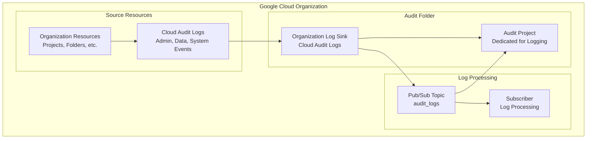

# Terraform Google Cloud Audit Module

This module creates and manages Google Cloud audit logging infrastructure with centralized log collection, storage, and monitoring capabilities.

## Overview

This module provides production-ready audit logging with:

- **Audit Project**: Dedicated project for audit logging infrastructure
- **Log Sink**: Organization-level log sink for cloud audit logs
- **Pub/Sub Topic**: Message queue for audit log processing
- **Folder Management**: Optional audit folder organization
- **Compliance**: Structured audit trail for security and compliance

## Architecture



## Usage

```hcl
module "audit_logging" {
  source = "./tf-modules/terraform-google-audit"

  # Required Variables
  billing_account         = "012345-678901-234567"
  domain                 = "example.com"
  audit_project_name     = "audit-logging-prod"
  audit_random_project_id = false

  # Folder Configuration
  audit_folder      = true
  audit_folder_name = "audit"
  org_parent_folder = "folders/123456789012"

  # Log Sink Configuration
  log_sink_name = "organization-audit-sink"
  topic_name    = "audit-logs-topic"

  # Subscription Configuration
  create_subscriber      = true
  create_push_subscriber = false
  push_endpoint         = ""
}
```

## Features

### Audit Logging
- **Organization-wide Coverage**: Captures audit logs from all organization resources
- **Cloud Audit Logs**: Admin activity, data access, system events
- **Structured Filtering**: Configurable log filters for specific audit requirements
- **Real-time Processing**: Pub/Sub based log streaming and processing

### Project Management
- **Dedicated Audit Project**: Isolated project for audit infrastructure
- **API Enablement**: Required APIs automatically enabled
- **Service Account Security**: Default service account deprivileged
- **Project Lien**: Protection against accidental project deletion

### Compliance Features
- **Centralized Collection**: All organization audit logs in single location
- **Immutable Storage**: Log sink ensures audit trail integrity
- **Access Controls**: IAM-based access to audit logs and infrastructure
- **Retention Policies**: Configurable log retention for compliance requirements

## Resources Created

### Core Resources
- `google_folder`: Optional audit folder for organization
- `module.audit_project`: Dedicated project using Project Factory
- `module.log_export`: Organization-level log sink
- `module.destination`: Pub/Sub topic and subscription

### Project APIs Enabled
- `logging.googleapis.com`: Cloud Logging API
- `compute.googleapis.com`: Compute Engine API
- `pubsub.googleapis.com`: Pub/Sub API

## Variables

### Required Variables

| Name | Description | Type |
|------|-------------|------|
| `billing_account` | Billing account for audit project | `string` |
| `domain` | Organization domain | `string` |
| `audit_project_name` | Name of the audit project | `string` |
| `audit_random_project_id` | Use random project ID suffix | `bool` |

### Organization Configuration

| Name | Description | Type | Default |
|------|-------------|------|---------|
| `org_parent_folder` | Parent folder for audit folder | `string` | `""` |
| `audit_folder` | Create dedicated audit folder | `bool` | `true` |
| `audit_folder_name` | Name of audit folder | `string` | `"audit"` |

### Log Sink Configuration

| Name | Description | Type | Default |
|------|-------------|------|---------|
| `log_sink_name` | Name of the log sink | `string` | `"organization_sink"` |
| `topic_name` | Pub/Sub topic name | `string` | `"audit_logs"` |

### Subscription Configuration

| Name | Description | Type | Default |
|------|-------------|------|---------|
| `create_subscriber` | Create pull subscription | `bool` | `true` |
| `create_push_subscriber` | Create push subscription | `bool` | `true` |
| `push_endpoint` | URL for push subscription | `string` | `""` |

## Log Filter

The module uses a default filter for Cloud Audit Logs:
```
logName:"logs/cloudaudit.googleapis.com"
```

This captures:
- **Admin Activity**: Administrative actions and API calls
- **Data Access**: Data read/write operations (when enabled)
- **System Events**: GCP system-generated audit events

## Security Configuration

### IAM and Access Control
- **Log Sink Writer**: Service account with minimal required permissions
- **Pub/Sub Access**: Subscriber roles granted to processing service account
- **Project Isolation**: Audit infrastructure isolated in dedicated project

### Compliance Features
- **Immutable Logs**: Log sink ensures audit trail cannot be modified
- **Access Logging**: All access to audit logs is itself logged
- **Encryption**: Logs encrypted in transit and at rest

## Outputs

| Name | Description |
|------|-------------|
| `project_id` | Audit project ID |
| `log_sink_writer_identity` | Service account email for log sink |
| `pubsub_topic` | Pub/Sub topic name for audit logs |
| `pubsub_subscription` | Pub/Sub subscription name |

## Common Configurations

### Basic Audit Setup
```hcl
module "audit_basic" {
  source = "./tf-modules/terraform-google-audit"
  
  billing_account         = var.billing_account
  domain                 = var.organization_domain
  audit_project_name     = "org-audit-logs"
  audit_random_project_id = true
  
  # Use organization root
  org_parent_folder = ""
  audit_folder      = false
}
```

### Enterprise Audit with Folder Structure
```hcl
module "audit_enterprise" {
  source = "./tf-modules/terraform-google-audit"
  
  billing_account         = var.billing_account
  domain                 = var.organization_domain
  audit_project_name     = "enterprise-audit-logs"
  audit_random_project_id = false
  
  # Structured folder organization
  org_parent_folder  = "folders/123456789012"
  audit_folder       = true
  audit_folder_name  = "security-audit"
  
  # Custom log processing
  topic_name            = "enterprise-audit-logs"
  create_push_subscriber = true
  push_endpoint         = "https://audit-processor.example.com/webhook"
}
```

### Multi-Region Audit
```hcl
module "audit_multi_region" {
  source = "./tf-modules/terraform-google-audit"
  
  billing_account         = var.billing_account
  domain                 = var.organization_domain
  audit_project_name     = "global-audit-logs"
  audit_random_project_id = false
  
  # Global audit configuration
  log_sink_name = "global-organization-audit"
  topic_name    = "global-audit-stream"
  
  # Processing subscribers
  create_subscriber      = true
  create_push_subscriber = false
}
```

## Monitoring and Operations

### Health Checks
```bash
# Check audit project status
gcloud projects describe AUDIT_PROJECT_ID

# Verify log sink configuration
gcloud logging sinks describe SINK_NAME --folder=FOLDER_ID

# Check Pub/Sub topic
gcloud pubsub topics describe TOPIC_NAME --project=AUDIT_PROJECT_ID
```

### Log Analysis
```bash
# Query audit logs
gcloud logging read 'logName="projects/AUDIT_PROJECT_ID/logs/cloudaudit.googleapis.com"' --limit=10

# Check log sink metrics
gcloud logging metrics list --project=AUDIT_PROJECT_ID

# Monitor Pub/Sub message flow
gcloud pubsub topics list-subscriptions TOPIC_NAME --project=AUDIT_PROJECT_ID
```

## Troubleshooting

### Common Issues

#### Log Sink Permission Errors
```
Error: Insufficient permissions for log sink writer
```
**Solution**: Verify organization-level IAM permissions for log sink service account

#### Pub/Sub Message Delivery Failures
```
Error: Messages not being delivered to subscription
```
**Solution**: Check topic permissions and subscription configuration

#### Project Creation Failures
```
Error: Project creation quota exceeded
```
**Solution**: Request project creation quota increase or use existing project

### Debugging Commands

```bash
# Check log sink status
gcloud logging sinks describe SINK_NAME --folder=FOLDER_ID

# Verify Pub/Sub permissions
gcloud pubsub topics get-iam-policy TOPIC_NAME --project=AUDIT_PROJECT_ID

# Test log message flow
gcloud pubsub subscriptions pull SUBSCRIPTION_NAME --project=AUDIT_PROJECT_ID
```

## Compliance Considerations

### Regulatory Requirements
- **SOX Compliance**: Supports financial audit trail requirements
- **PCI DSS**: Provides required logging for payment card data
- **HIPAA**: Audit logging for healthcare data access
- **GDPR**: Access logging for personal data processing

### Retention Policies
- Configure appropriate log retention periods based on compliance requirements
- Consider long-term archival to Cloud Storage for cost optimization
- Implement lifecycle policies for automated log management

## Cost Optimization

### Storage Costs
- Monitor Pub/Sub message volume and retention
- Implement log filtering to reduce noise and costs
- Consider BigQuery for large-scale log analysis instead of Pub/Sub

### Processing Costs
- Right-size Pub/Sub subscriptions based on processing requirements
- Use pull subscriptions for batch processing to reduce costs
- Monitor and optimize push endpoint costs

## Dependencies

### Organization Prerequisites
- Organization-level access to create folders and log sinks
- Billing account access for audit project creation
- Domain verification for organization identification

### IAM Prerequisites
- Organization Admin role for folder and log sink creation
- Project Creator role for audit project setup
- Pub/Sub Admin role for topic and subscription management

### API Prerequisites
The following APIs must be enabled in the audit project:
- `logging.googleapis.com`
- `pubsub.googleapis.com`  
- `compute.googleapis.com`

## Related Documentation

- [Cloud Audit Logs Documentation](https://cloud.google.com/logging/docs/audit)
- [Log Export Module](https://registry.terraform.io/modules/terraform-google-modules/log-export/google)
- [Project Factory Module](https://registry.terraform.io/modules/terraform-google-modules/project-factory/google)

---

**⚠️ Audit Infrastructure**: This module manages critical audit logging infrastructure. Changes may affect compliance and security monitoring capabilities.