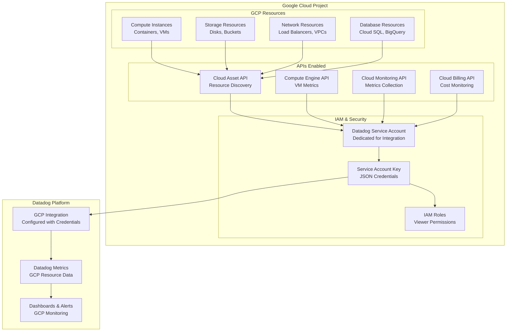

# Terraform Google Cloud Datadog Integration Module

This module creates and manages Datadog integration with Google Cloud Platform, enabling comprehensive monitoring, alerting, and observability for GCP resources.

## Overview

This module provides production-ready Datadog-GCP integration with:

- **Service Account**: Dedicated service account for Datadog access
- **IAM Permissions**: Minimal required permissions for monitoring
- **API Enablement**: Required GCP APIs for data collection
- **Datadog Integration**: Automated setup of GCP integration in Datadog
- **Host Filtering**: Configurable resource filtering for targeted monitoring

## Architecture



## Usage

```hcl
module "datadog_integration" {
  source = "./tf-modules/terraform-google-dd"

  # Required Variables
  project_id = "my-gcp-project"
  
  # Datadog API Configuration
  datadog_api_key = var.datadog_api_key
  datadog_app_key = var.datadog_app_key

  # Host Filtering (Optional)
  host_filters = [
    "env:production",
    "service:web-app",
    "region:us-east1"
  ]
}
```

### Environment-Specific Configuration

```hcl
# Production Environment
module "datadog_prod" {
  source = "./tf-modules/terraform-google-dd"
  
  project_id      = "company-prod-12345"
  datadog_api_key = var.datadog_prod_api_key
  datadog_app_key = var.datadog_prod_app_key
  
  host_filters = [
    "env:production",
    "criticality:high"
  ]
}

# Development Environment  
module "datadog_dev" {
  source = "./tf-modules/terraform-google-dd"
  
  project_id      = "company-dev-67890"
  datadog_api_key = var.datadog_dev_api_key
  datadog_app_key = var.datadog_dev_app_key
  
  host_filters = [
    "env:development",
    "team:engineering"
  ]
}
```

## Features

### Service Account Management
- **Dedicated Service Account**: Created specifically for Datadog integration
- **Minimal Permissions**: Follows least privilege security principle
- **Secure Key Management**: Service account key handled securely
- **Display Name**: Clear identification of integration purpose

### API Integration
- **Cloud Asset API**: Comprehensive resource discovery and inventory
- **Compute Engine API**: VM instances, disks, and compute metrics
- **Cloud Monitoring API**: Native GCP metrics and custom metrics
- **Cloud Billing API**: Cost and usage monitoring integration

### Security Configuration
- **Viewer-Only Access**: Read-only permissions prevent accidental changes
- **Project-Scoped**: Integration limited to specified project
- **Key Rotation**: Service account keys can be rotated as needed
- **Host Filtering**: Limit monitoring scope to specific resources

## Resources Created

### IAM Resources
- `module.service_account`: Datadog integration service account
- `google_service_account_key`: JSON key for Datadog authentication
- `google_project_iam_member`: IAM role bindings for service account

### API Resources
- `google_project_service`: Required API enablement for monitoring

### Datadog Resources
- `datadog_integration_gcp`: Datadog GCP integration configuration

## Variables

### Required Variables

| Name | Description | Type |
|------|-------------|------|
| `project_id` | GCP project ID to monitor | `string` |
| `datadog_api_key` | Datadog API key | `string` |
| `datadog_app_key` | Datadog application key | `string` |

### Optional Variables

| Name | Description | Type | Default |
|------|-------------|------|---------|
| `host_filters` | List of host filters for Datadog | `list(string)` | `[]` |

## IAM Roles Assigned

The Datadog service account receives the following minimal permissions:

| Role | Purpose |
|------|---------|
| `roles/cloudasset.viewer` | Resource discovery and inventory |
| `roles/compute.viewer` | Compute Engine metrics and metadata |
| `roles/monitoring.viewer` | Cloud Monitoring metrics access |

## APIs Enabled

The following APIs are automatically enabled:

| API | Purpose |
|-----|---------|
| `cloudasset.googleapis.com` | Asset inventory and configuration |
| `cloudbilling.googleapis.com` | Billing and cost information |
| `compute.googleapis.com` | Compute Engine resources |
| `monitoring.googleapis.com` | Cloud Monitoring metrics |

## Host Filtering

Host filters allow you to control which GCP resources are monitored by Datadog:

### Common Filter Patterns
```hcl
# Environment-based filtering
host_filters = ["env:production", "env:staging"]

# Service-based filtering  
host_filters = ["service:web-app", "service:database"]

# Region-based filtering
host_filters = ["region:us-east1", "region:europe-west1"]

# Team-based filtering
host_filters = ["team:platform", "team:data"]

# Criticality-based filtering
host_filters = ["criticality:high", "criticality:medium"]
```

## Outputs

| Name | Description |
|------|-------------|
| `service_account_email` | Email of the created Datadog service account |
| `integration_id` | Datadog GCP integration identifier |

## Security Best Practices

### Service Account Security
```hcl
# Rotate service account keys regularly
resource "google_service_account_key" "datadog" {
  service_account_id = module.service_account.email
  
  # Add key rotation lifecycle
  lifecycle {
    create_before_destroy = true
  }
}
```

### API Key Management
```hcl
# Use environment variables or secret management
variable "datadog_api_key" {
  description = "Datadog API key"
  type        = string
  sensitive   = true
}

variable "datadog_app_key" {
  description = "Datadog application key"
  type        = string
  sensitive   = true
}
```

## Monitoring Setup

### Key Metrics Available
- **Compute Engine**: CPU, memory, disk, network metrics
- **Cloud Storage**: Bucket usage, request rates, error rates
- **Cloud SQL**: Database performance, connections, queries
- **Load Balancers**: Request rates, latency, error rates
- **BigQuery**: Job performance, slot usage, data processed

### Dashboard Creation
```hcl
# Example Datadog dashboard for GCP monitoring
resource "datadog_dashboard" "gcp_overview" {
  title       = "GCP Infrastructure Overview"
  description = "High-level overview of GCP resources"
  layout_type = "ordered"

  widget {
    timeseries_definition {
      title = "GCE Instance CPU Usage"
      request {
        q = "avg:gcp.compute.instance.cpu.utilization{*} by {instance_name}"
      }
    }
  }
}
```

## Troubleshooting

### Common Issues

#### API Key Authentication Errors
```
Error: Invalid API key or application key
```
**Solution**: Verify Datadog API and application keys are correct and have appropriate permissions

#### Service Account Permission Errors
```
Error: Insufficient permissions for service account
```
**Solution**: Verify IAM roles are correctly assigned and APIs are enabled

#### Host Filter Syntax Errors
```
Error: Invalid host filter format
```
**Solution**: Check host filter syntax matches Datadog tag format (key:value)

### Debugging Commands

```bash
# Verify service account creation
gcloud iam service-accounts describe SERVICE_ACCOUNT_EMAIL --project=PROJECT_ID

# Check API enablement
gcloud services list --enabled --project=PROJECT_ID

# Test service account permissions
gcloud auth activate-service-account --key-file=service-account-key.json
gcloud compute instances list --project=PROJECT_ID
```

## Integration Validation

### Verify Integration Status
1. **Datadog Console**: Check GCP integration status in Datadog UI
2. **Metrics Flow**: Verify GCP metrics appearing in Datadog
3. **Host Discovery**: Confirm filtered hosts appear correctly

### Health Checks
```bash
# Check integration in Datadog
curl -X GET "https://api.datadoghq.com/api/v1/integration/gcp" \
  -H "DD-API-KEY: ${DD_API_KEY}" \
  -H "DD-APPLICATION-KEY: ${DD_APP_KEY}"
```

## Cost Considerations

### Datadog Costs
- Monitor the number of hosts and custom metrics being ingested
- Use host filters to control monitoring scope and costs
- Regular cleanup of unused integrations and dashboards

### GCP Costs
- API calls incur minimal costs but should be monitored
- Service account and IAM operations are typically free
- Consider API quotas and limits for high-volume environments

## Dependencies

### Datadog Prerequisites
- Valid Datadog account with API access
- Datadog API key and application key with integration permissions
- Datadog GCP integration feature enabled

### GCP Prerequisites
- GCP project with billing enabled
- Sufficient IAM permissions to create service accounts and assign roles
- Organization policies allowing service account key creation

### Provider Configuration
```hcl
# Required providers
terraform {
  required_providers {
    google = {
      source  = "hashicorp/google"
      version = ">= 4.0"
    }
    datadog = {
      source  = "datadog/datadog"
      version = ">= 1.9"
    }
  }
}

# Provider configuration
provider "datadog" {
  api_key = var.datadog_api_key
  app_key = var.datadog_app_key
}
```

## Related Documentation

- [Datadog GCP Integration Guide](https://docs.datadoghq.com/integrations/google_cloud_platform/)
- [GCP Service Accounts Documentation](https://cloud.google.com/iam/docs/service-accounts)
- [Datadog Terraform Provider](https://registry.terraform.io/providers/DataDog/datadog/latest/docs)

---

**⚠️ Security Sensitive**: This module handles service account keys and API credentials. Ensure proper secret management and key rotation practices.