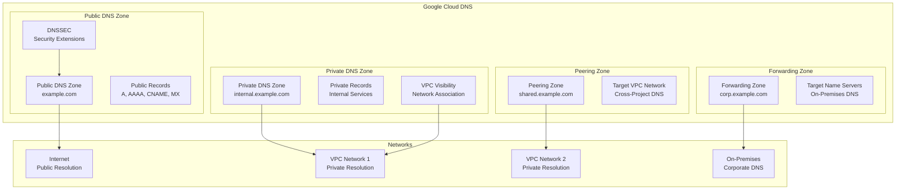

# Terraform Google Cloud DNS Module

This module creates and manages Google Cloud DNS zones with support for public, private, forwarding, and peering DNS configurations.

## Overview

This module provides comprehensive DNS management with:

- **Multiple Zone Types**: Public, private, forwarding, and peering zones
- **DNS Record Management**: A, AAAA, CNAME, MX, TXT, and other record types
- **DNSSEC Support**: Automatic DNS security extensions
- **VPC Integration**: Private DNS zones with VPC network visibility
- **DNS Forwarding**: Custom DNS resolver integration
- **Zone Peering**: Cross-project and cross-VPC DNS resolution

## Architecture



## Usage

### Public DNS Zone
```hcl
module "public_dns" {
  source = "./tf-modules/terraform-google-dns"

  project_id  = "my-gcp-project"
  type        = "public"
  name        = "example-com"
  domain      = "example.com."
  description = "Public DNS zone for example.com"

  # Enable DNSSEC
  dnssec_config = {
    state = "on"
    kind  = "dns#managedZoneDnsSecConfig"
  }

  # DNS Records
  recordsets = [
    {
      name    = "www"
      type    = "A"
      ttl     = 300
      records = ["203.0.113.1"]
    },
    {
      name    = ""
      type    = "MX"
      ttl     = 300
      records = ["10 mail.example.com."]
    }
  ]
}
```

### Private DNS Zone
```hcl
module "private_dns" {
  source = "./tf-modules/terraform-google-dns"

  project_id  = "my-gcp-project"
  type        = "private"
  name        = "internal-zone"
  domain      = "internal.example.com."
  description = "Private DNS zone for internal services"

  # VPC Networks that can resolve this zone
  private_visibility_config_networks = [
    "projects/my-gcp-project/global/networks/vpc-network",
    "projects/my-gcp-project/global/networks/shared-vpc"
  ]

  recordsets = [
    {
      name    = "api"
      type    = "A"
      ttl     = 300
      records = ["10.0.1.100"]
    },
    {
      name    = "database"
      type    = "A" 
      ttl     = 300
      records = ["10.0.2.100"]
    }
  ]
}
```

### DNS Forwarding Zone
```hcl
module "forwarding_dns" {
  source = "./tf-modules/terraform-google-dns"

  project_id  = "my-gcp-project"
  type        = "forwarding"
  name        = "corp-forward"
  domain      = "corp.example.com."
  description = "Forward DNS queries to on-premises"

  # Target name servers (on-premises DNS)
  target_name_server_addresses = [
    {
      ipv4_address    = "192.168.1.10"
      forwarding_path = "default"
    },
    {
      ipv4_address    = "192.168.1.11"
      forwarding_path = "default"
    }
  ]

  # VPC networks that can use this forwarder
  private_visibility_config_networks = [
    "projects/my-gcp-project/global/networks/hybrid-vpc"
  ]
}
```

### DNS Peering Zone
```hcl
module "peering_dns" {
  source = "./tf-modules/terraform-google-dns"

  project_id  = "my-gcp-project"
  type        = "peering"
  name        = "shared-services"
  domain      = "shared.example.com."
  description = "Peer with shared services VPC"

  # Target VPC network for peering
  target_network = "projects/shared-services-project/global/networks/shared-vpc"

  # Local VPC networks that can access peered zone
  private_visibility_config_networks = [
    "projects/my-gcp-project/global/networks/app-vpc"
  ]
}
```

## Features

### Zone Types
- **Public Zones**: Internet-facing DNS resolution
- **Private Zones**: VPC-internal DNS resolution
- **Forwarding Zones**: Route queries to external DNS servers
- **Peering Zones**: Share DNS between VPC networks

### Security Features
- **DNSSEC**: Automatic DNS security extensions for public zones
- **VPC Isolation**: Private zones only accessible from specified VPCs
- **Network Controls**: Fine-grained visibility configuration
- **Force Destroy Protection**: Prevent accidental zone deletion

### Record Management
- **Multiple Record Types**: A, AAAA, CNAME, MX, TXT, SRV, PTR
- **Bulk Record Creation**: Manage multiple records per zone
- **TTL Configuration**: Configurable time-to-live values
- **Dynamic Updates**: Terraform-managed record updates

## Resources Created

### Core Resources
- `module.dns`: Cloud DNS managed zone using official GCP module

### Supported Zone Types
- **Public Zone**: `google_dns_managed_zone` (public)
- **Private Zone**: `google_dns_managed_zone` (private)
- **Forwarding Zone**: `google_dns_managed_zone` (forwarding)
- **Peering Zone**: `google_dns_managed_zone` (peering)

## Variables

### Required Variables

| Name | Description | Type |
|------|-------------|------|
| `project_id` | GCP project ID | `string` |
| `name` | DNS zone name (unique within project) | `string` |
| `domain` | DNS domain (must end with period) | `string` |

### Zone Configuration

| Name | Description | Type | Default |
|------|-------------|------|---------|
| `type` | Zone type (public/private/forwarding/peering) | `string` | `"private"` |
| `description` | Zone description | `string` | `"Managed by Terraform"` |
| `force_destroy` | Allow zone deletion with records | `bool` | `false` |
| `labels` | Resource labels | `map(any)` | `{}` |

### Private Zone Configuration

| Name | Description | Type | Default |
|------|-------------|------|---------|
| `private_visibility_config_networks` | VPC networks that can resolve this zone | `list(string)` | `[]` |

### Forwarding Zone Configuration

| Name | Description | Type | Default |
|------|-------------|------|---------|
| `target_name_server_addresses` | Target DNS servers for forwarding | `list(map(any))` | `[]` |

### Peering Zone Configuration

| Name | Description | Type | Default |
|------|-------------|------|---------|
| `target_network` | Target VPC network for peering | `string` | `""` |

### DNSSEC Configuration

| Name | Description | Type | Default |
|------|-------------|------|---------|
| `dnssec_config` | DNSSEC configuration object | `any` | `{}` |
| `default_key_specs_key` | Key signing specifications | `any` | `{}` |
| `default_key_specs_zone` | Zone signing specifications | `any` | `{}` |

### DNS Records

| Name | Description | Type | Default |
|------|-------------|------|---------|
| `recordsets` | List of DNS records to create | `list(object)` | `[]` |

#### DNS Record Structure
```hcl
recordsets = [
  {
    name    = "subdomain"      # Record name (without domain)
    type    = "A"              # Record type
    ttl     = 300              # Time to live in seconds
    records = ["1.2.3.4"]     # List of record values
  }
]
```

## DNS Record Types

### Common Record Types
- **A**: IPv4 address records
- **AAAA**: IPv6 address records  
- **CNAME**: Canonical name records
- **MX**: Mail exchange records
- **TXT**: Text records
- **SRV**: Service records
- **PTR**: Pointer records (reverse DNS)

### Record Examples
```hcl
recordsets = [
  # Web server
  {
    name    = "www"
    type    = "A"
    ttl     = 300
    records = ["203.0.113.10"]
  },
  
  # Mail server
  {
    name    = ""
    type    = "MX"
    ttl     = 300
    records = ["10 mail.example.com.", "20 backup-mail.example.com."]
  },
  
  # Service discovery
  {
    name    = "_http._tcp.api"
    type    = "SRV"
    ttl     = 300
    records = ["10 5 80 api.example.com."]
  },
  
  # Domain verification
  {
    name    = ""
    type    = "TXT"
    ttl     = 300
    records = ["v=spf1 include:_spf.google.com ~all"]
  }
]
```

## DNSSEC Configuration

### Enable DNSSEC for Public Zones
```hcl
dnssec_config = {
  state         = "on"
  kind          = "dns#managedZoneDnsSecConfig"
  non_existence = "nsec3"
}

# Custom key specifications
default_key_specs_key = {
  algorithm  = "rsasha256"
  key_length = 2048
  key_type   = "keySigning"
  kind       = "dns#dnsKeySpec"
}

default_key_specs_zone = {
  algorithm  = "rsasha256"
  key_length = 1024
  key_type   = "zoneSigning"  
  kind       = "dns#dnsKeySpec"
}
```

## Outputs

| Name | Description |
|------|-------------|
| `domain` | The DNS zone domain |
| `name` | The DNS zone name |
| `type` | The DNS zone type |
| `name_servers` | List of name servers for the zone |

## Common Configurations

### Multi-Environment DNS Setup
```hcl
# Production public zone
module "prod_public_dns" {
  source = "./tf-modules/terraform-google-dns"
  
  project_id = "company-prod"
  type       = "public"
  name       = "company-com"
  domain     = "company.com."
  
  dnssec_config = { state = "on" }
  
  recordsets = [
    {
      name    = ""
      type    = "A"
      ttl     = 300
      records = ["203.0.113.10"]
    }
  ]
}

# Development private zone
module "dev_private_dns" {
  source = "./tf-modules/terraform-google-dns"
  
  project_id = "company-dev"
  type       = "private"
  name       = "dev-internal"
  domain     = "dev.company.internal."
  
  private_visibility_config_networks = [
    "projects/company-dev/global/networks/dev-vpc"
  ]
}
```

### Hybrid Cloud DNS Setup
```hcl
# Forward corporate domains to on-premises
module "corp_forwarding" {
  source = "./tf-modules/terraform-google-dns"
  
  project_id = "company-hybrid"
  type       = "forwarding"
  name       = "corp-forward"
  domain     = "corp.company.com."
  
  target_name_server_addresses = [
    {
      ipv4_address    = "10.0.0.10"
      forwarding_path = "default"
    }
  ]
  
  private_visibility_config_networks = [
    "projects/company-hybrid/global/networks/hybrid-vpc"
  ]
}

# Private zone for cloud services
module "cloud_private" {
  source = "./tf-modules/terraform-google-dns"
  
  project_id = "company-hybrid"
  type       = "private"
  name       = "cloud-services"
  domain     = "cloud.company.com."
  
  private_visibility_config_networks = [
    "projects/company-hybrid/global/networks/hybrid-vpc"
  ]
}
```

## Troubleshooting

### Common Issues

#### Zone Creation Failures
```
Error: DNS zone already exists
```
**Solution**: Choose a unique zone name within the project

#### DNSSEC Validation Errors
```
Error: DNSSEC validation failed
```
**Solution**: Verify parent zone DS records are correctly configured

#### Private Zone Resolution Issues
```
Error: Private zone not resolving from VPC
```
**Solution**: Verify VPC network is included in `private_visibility_config_networks`

### Debugging Commands

```bash
# Check zone status
gcloud dns managed-zones describe ZONE_NAME --project=PROJECT_ID

# List zone records
gcloud dns record-sets list --zone=ZONE_NAME --project=PROJECT_ID

# Test DNS resolution
dig @8.8.8.8 example.com
nslookup api.internal.company.com 169.254.169.254
```

## Best Practices

### Zone Organization
- Use descriptive zone names that indicate purpose and environment
- Implement consistent naming conventions across projects
- Separate public and private zones for security isolation
- Use labels for resource organization and billing tracking

### Record Management
- Use reasonable TTL values (300-3600 seconds for most records)
- Group related records in the same configuration for easier management
- Implement proper MX record priorities for mail routing
- Use CNAME records judiciously to avoid resolution chains

### Security Considerations
- Enable DNSSEC for all public zones
- Limit private zone visibility to necessary VPC networks only
- Regular audit of DNS records and zone configurations
- Monitor DNS query patterns for anomalies

## Dependencies

### GCP Prerequisites
- DNS API enabled in the target project
- Appropriate IAM permissions for DNS zone management
- VPC networks created (for private/forwarding/peering zones)

### API Prerequisites
The following APIs must be enabled:
- `dns.googleapis.com`

## Related Documentation

- [Cloud DNS Module](https://registry.terraform.io/modules/terraform-google-modules/cloud-dns/google)
- [Google Cloud DNS Documentation](https://cloud.google.com/dns/docs)
- [DNSSEC Configuration Guide](https://cloud.google.com/dns/docs/dnssec-config)

---

**⚠️ DNS Infrastructure**: DNS changes can affect service availability. Test changes in development environments first and consider TTL values when planning updates.