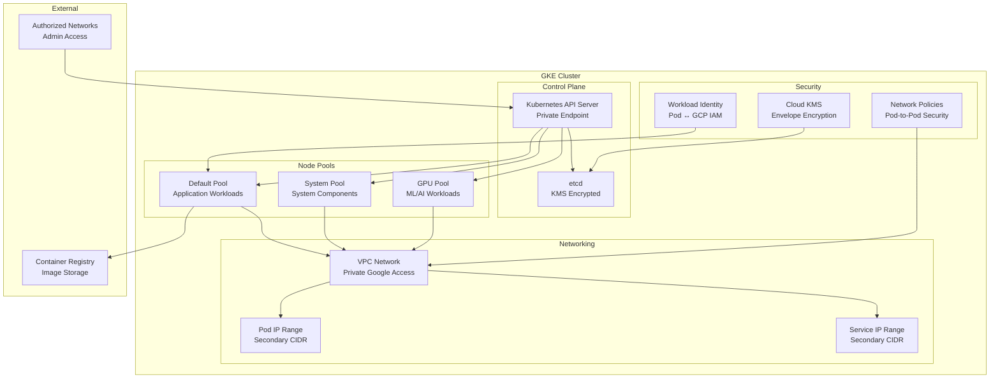

# Terraform Google GKE Module

This module creates and manages Google Kubernetes Engine (GKE) clusters with comprehensive security, networking, and operational features.

## Overview

This module provides a production-ready GKE cluster with:

- **Private Clusters**: Nodes without external IPs for enhanced security
- **Workload Identity**: Secure service-to-service authentication
- **Multiple Node Pools**: Flexible compute resources for different workloads
- **Network Security**: VPC-native networking with network policies
- **KMS Integration**: Envelope encryption for etcd and application secrets
- **IAM Management**: Proper service account and permissions setup

## Usage

```hcl
module "gke_cluster" {
  source = "./tf-modules/terraform-google-gke"

  # Required Variables
  name                   = "production-cluster"
  project_id            = "my-gcp-project"
  region                = "us-central1"
  network               = "projects/my-project/global/networks/vpc"
  subnetwork           = "projects/my-project/regions/us-central1/subnetworks/gke-subnet"
  
  # Networking
  ip_range_pods        = "gke-pods-range"
  ip_range_services    = "gke-services-range"
  master_ipv4_cidr_block = "172.16.0.0/28"
  
  # Security
  enable_private_nodes     = true
  enable_private_endpoint  = true
  master_authorized_networks = [
    {
      cidr_block   = "10.0.0.0/8"
      display_name = "Private networks"
    }
  ]
  
  # Node Pools
  node_pools = [
    {
      name               = "default-pool"
      machine_type      = "e2-standard-4"
      min_count         = 1
      max_count         = 10
      disk_size_gb      = 100
      disk_type         = "pd-ssd"
      image_type        = "COS_CONTAINERD"
      auto_repair       = true
      auto_upgrade      = true
      preemptible       = false
      initial_node_count = 3
    }
  ]
  
  # Features
  network_policy                = true
  http_load_balancing          = true
  horizontal_pod_autoscaling   = true
  database_encryption          = true
  
  # Workload Identity
  identity_namespace = "my-gcp-project.svc.id.goog"
}
```

## Architecture



## Features

### Security Features
- **Private Cluster**: Nodes have no external IPs
- **Private Endpoint**: API server accessible only from authorized networks
- **Workload Identity**: Secure pod-to-GCP service authentication
- **Network Policies**: Calico-based pod-to-pod communication control
- **Database Encryption**: etcd encryption using Cloud KMS
- **Shielded Nodes**: Protection against rootkits and bootkits
- **Image Security**: Binary Authorization for container image validation

### Networking Features
- **VPC-Native**: Uses alias IP ranges for pods and services
- **Secondary IP Ranges**: Efficient IP utilization
- **Network Policy**: Micro-segmentation within cluster
- **Load Balancing**: Google Cloud Load Balancer integration
- **Private Google Access**: Access to Google services without external IPs

### Operational Features
- **Auto Scaling**: Cluster and pod-level autoscaling
- **Auto Repair**: Automatic node repair and recreation
- **Auto Upgrade**: Managed Kubernetes version upgrades
- **Monitoring**: Integration with Cloud Operations (Stackdriver)
- **Logging**: Centralized logging to Cloud Logging

## Resources Created

### Core Resources
- `google_container_cluster`: Main GKE cluster
- `google_container_node_pool`: Node pools for different workload types
- `google_service_account`: Cluster and node service accounts
- `google_project_iam_binding`: Required IAM permissions
- `google_kms_crypto_key`: Database encryption key (if enabled)

### Security Resources
- `google_service_account_iam_binding`: Workload Identity bindings
- `google_project_iam_binding`: Node pool permissions
- `google_kms_crypto_key_iam_binding`: KMS key permissions

## Variables

### Required Variables

| Name | Description | Type |
|------|-------------|------|
| `name` | Cluster name | `string` |
| `project_id` | GCP project ID | `string` |
| `region` | GCP region | `string` |
| `network` | VPC network self-link | `string` |
| `subnetwork` | VPC subnetwork self-link | `string` |

### Networking Variables

| Name | Description | Type | Default |
|------|-------------|------|---------|
| `ip_range_pods` | Secondary range name for pods | `string` | `""` |
| `ip_range_services` | Secondary range name for services | `string` | `""` |
| `master_ipv4_cidr_block` | Control plane CIDR | `string` | `"172.16.0.0/28"` |
| `enable_private_nodes` | Enable private nodes | `bool` | `true` |
| `enable_private_endpoint` | Enable private endpoint | `bool` | `false` |

### Security Variables

| Name | Description | Type | Default |
|------|-------------|------|---------|
| `master_authorized_networks` | Authorized networks for API access | `list(object)` | `[]` |
| `network_policy` | Enable network policy | `bool` | `true` |
| `network_policy_provider` | Network policy provider | `string` | `"CALICO"` |
| `database_encryption` | Enable database encryption | `bool` | `true` |

### Node Pool Variables

| Name | Description | Type | Default |
|------|-------------|------|---------|
| `node_pools` | Node pool configurations | `list(object)` | See below |
| `node_pools_oauth_scopes` | OAuth scopes per node pool | `map(list(string))` | `{}` |
| `node_pools_labels` | Labels per node pool | `map(map(string))` | `{}` |
| `node_pools_metadata` | Metadata per node pool | `map(map(string))` | `{}` |
| `node_pools_taints` | Taints per node pool | `map(list(object))` | `{}` |

### Node Pool Configuration Example

```hcl
node_pools = [
  {
    name               = "default-pool"
    machine_type       = "e2-standard-4"
    min_count          = 1
    max_count          = 10
    local_ssd_count    = 0
    disk_size_gb       = 100
    disk_type          = "pd-standard"
    image_type         = "COS_CONTAINERD"
    auto_repair        = true
    auto_upgrade       = true
    service_account    = ""  # Uses default if empty
    preemptible        = false
    initial_node_count = 1
  },
  {
    name               = "high-mem-pool"
    machine_type       = "n1-highmem-4"
    min_count          = 0
    max_count          = 5
    local_ssd_count    = 1
    disk_size_gb       = 200
    disk_type          = "pd-ssd"
    image_type         = "COS_CONTAINERD"
    auto_repair        = true
    auto_upgrade       = true
    preemptible        = true
    initial_node_count = 0
  }
]
```

### Feature Toggle Variables

| Name | Description | Type | Default |
|------|-------------|------|---------|
| `http_load_balancing` | Enable HTTP load balancing add-on | `bool` | `true` |
| `horizontal_pod_autoscaling` | Enable HPA add-on | `bool` | `true` |
| `network_policy` | Enable network policy add-on | `bool` | `true` |
| `istio` | Enable Istio add-on | `bool` | `false` |
| `cloudrun` | Enable Cloud Run add-on | `bool` | `false` |

## Outputs

| Name | Description |
|------|-------------|
| `cluster_id` | Cluster ID (project/location/name) |
| `name` | Cluster name |
| `endpoint` | Cluster endpoint |
| `min_master_version` | Minimum master version |
| `master_version` | Current master version |
| `ca_certificate` | Cluster CA certificate (base64 encoded) |
| `service_account` | Default service account used by nodes |
| `cluster_ipv4_cidr` | IPv4 CIDR block of the cluster |
| `location` | Cluster location (region or zone) |

## Security Best Practices

### Network Security
- Always use private clusters in production
- Restrict authorized networks to necessary IP ranges
- Enable network policies for pod-to-pod security
- Use VPC-native networking with secondary ranges

### Access Control
- Use Workload Identity instead of service account keys
- Apply principle of least privilege to node service accounts
- Regularly audit cluster RBAC permissions
- Enable Binary Authorization for image security

### Data Protection
- Enable envelope encryption with customer-managed keys
- Use private Google Access for pulling images
- Encrypt data at rest in persistent volumes
- Implement backup strategies for stateful workloads

## Common Configurations

### Development Environment
```hcl
# Smaller, cost-optimized cluster for development
enable_private_endpoint = false  # Allow easier access
node_pools = [{
  name               = "dev-pool"
  machine_type       = "e2-medium"
  min_count          = 1
  max_count          = 3
  preemptible        = true
  initial_node_count = 1
}]
```

### Production Environment
```hcl
# Highly available, secure production cluster
enable_private_endpoint = true
database_encryption    = true
master_authorized_networks = [
  {
    cidr_block   = "10.0.0.0/8"
    display_name = "Corporate network"
  }
]
node_pools = [
  {
    name               = "system-pool"
    machine_type       = "e2-standard-2"
    min_count          = 3
    max_count          = 5
    preemptible        = false
  },
  {
    name               = "app-pool"
    machine_type       = "n2-standard-4"
    min_count          = 2
    max_count          = 20
    preemptible        = false
  }
]
```

## Troubleshooting

### Common Issues

#### Private Cluster Access Issues
```
Error: Unable to connect to the cluster
```
**Solution**: Ensure your client IP is in `master_authorized_networks`

#### Node Pool Creation Fails
```
Error: Insufficient quota for resource 'IN_USE_ADDRESSES'
```
**Solution**: Check project quotas and request increases if needed

#### Workload Identity Issues
```
Error: pods is forbidden: User "system:serviceaccount:..." cannot list resource "pods"
```
**Solution**: Verify Workload Identity bindings and Kubernetes RBAC

### Debugging Commands

```bash
# Check cluster status
gcloud container clusters describe CLUSTER_NAME --region=REGION

# Get cluster credentials
gcloud container clusters get-credentials CLUSTER_NAME --region=REGION

# Check node pool status
gcloud container node-pools list --cluster=CLUSTER_NAME --region=REGION

# Verify Workload Identity
kubectl annotate serviceaccount KSA_NAME iam.gke.io/gcp-service-account=GSA_NAME@PROJECT_ID.iam.gserviceaccount.com
```

## Monitoring and Maintenance

### Essential Monitoring
- Cluster resource utilization (CPU, memory, disk)
- Node pool health and auto-scaling events  
- Control plane logs and audit logs
- Network policy violations
- Workload Identity usage and errors

### Maintenance Tasks
- Regular cluster and node pool upgrades
- Security patch application
- Backup verification for stateful workloads
- Cost optimization reviews
- Capacity planning based on growth trends

## Dependencies

### Network Prerequisites
- VPC with appropriate subnets
- Secondary IP ranges for pods and services
- Firewall rules for cluster communication
- NAT or Cloud NAT for outbound internet access

### IAM Prerequisites
- Service account with GKE cluster admin permissions
- Workload Identity configuration
- Appropriate node service account permissions

### API Prerequisites
The following APIs must be enabled:
- `container.googleapis.com`
- `compute.googleapis.com`
- `cloudkms.googleapis.com` (if encryption enabled)
- `iamcredentials.googleapis.com` (for Workload Identity)

## Contributing

When modifying this module:
1. Test changes in development environment first
2. Verify backward compatibility with existing clusters
3. Update documentation for new features
4. Follow security best practices
5. Test upgrade/downgrade scenarios

---

**⚠️ Production Ready**: This module is designed for production use with security hardening and operational best practices.