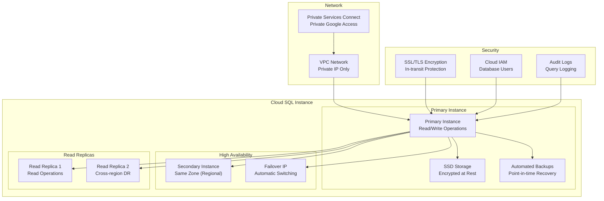

# Terraform Google Cloud SQL Module

This module creates and manages Google Cloud SQL instances with comprehensive security, high availability, and backup configurations.

## Overview

This module provides production-ready Cloud SQL instances with:

- **Private IP Connectivity**: Database instances without public IPs
- **High Availability**: Regional persistence and automatic failover
- **Automated Backups**: Point-in-time recovery with configurable retention
- **Security Hardening**: SSL enforcement, authorized networks, database flags
- **Multi-Database Support**: PostgreSQL, MySQL, and SQL Server
- **Read Replicas**: Cross-region disaster recovery and read scaling

## Usage

```hcl
module "cloud_sql" {
  source = "./tf-modules/terraform-google-sql"

  # Required Variables
  name               = "production-database"
  random_instance_name = false
  project_id         = "my-gcp-project"
  region             = "us-central1"
  zone               = "us-central1-a"
  
  # Database Configuration
  database_version   = "POSTGRES_14"
  tier              = "db-custom-4-16384"  # 4 vCPU, 16GB RAM
  availability_type = "REGIONAL"
  deletion_protection = true
  
  # Network Security
  ip_configuration = {
    ipv4_enabled       = false
    private_network    = "projects/my-project/global/networks/vpc"
    require_ssl        = true
    authorized_networks = []
  }
  
  # Database and User
  db_name        = "app_database"
  db_charset     = "UTF8"
  db_collation   = "en_US.UTF8"
  user_name      = "app_user"
  user_password  = "secure_password_123"
  
  # Backup Configuration
  backup_configuration = {
    enabled                        = true
    start_time                    = "03:00"
    location                      = "us"
    point_in_time_recovery_enabled = true
    transaction_log_retention_days = 7
    retained_backups              = 30
    retention_unit                = "COUNT"
  }
}
```

## Architecture



## Features

### Security Features
- **Private IP**: No public IP address exposure
- **SSL/TLS Encryption**: Required encrypted connections
- **Authorized Networks**: IP-based access control
- **IAM Database Authentication**: Google Cloud IAM integration
- **Audit Logging**: Query and connection logging
- **At-rest Encryption**: Google-managed or customer-managed encryption

### High Availability
- **Regional Persistence**: Automatic failover to secondary zone
- **Read Replicas**: Horizontal read scaling and disaster recovery
- **Connection Pooling**: PgBouncer integration for PostgreSQL
- **Maintenance Windows**: Controlled update scheduling

### Backup and Recovery
- **Automated Backups**: Daily full backups with configurable timing
- **Point-in-time Recovery**: Restore to any point in time
- **Cross-region Backup**: Geographic backup distribution
- **Export/Import**: BigQuery and Cloud Storage integration

## Resources Created

### Core Resources
- `google_sql_database_instance`: Primary database instance
- `google_sql_database`: Application databases
- `google_sql_user`: Database users and service accounts
- `google_sql_ssl_cert`: SSL certificates for secure connections

### Network Resources
- `google_compute_global_address`: Private IP address reservation
- `google_service_networking_connection`: VPC peering for private access

### Optional Resources
- `google_sql_database_instance` (replica): Read replicas
- `google_sql_backup_configuration`: Custom backup settings
- `google_monitoring_alert_policy`: Database monitoring alerts

## Variables

### Required Variables

| Name | Description | Type |
|------|-------------|------|
| `name` | Database instance name | `string` |
| `project_id` | GCP project ID | `string` |
| `region` | GCP region | `string` |
| `database_version` | Database version (e.g., POSTGRES_14) | `string` |

### Database Configuration

| Name | Description | Type | Default |
|------|-------------|------|---------|
| `tier` | Machine type (db-custom-2-7680) | `string` | `"db-custom-1-3840"` |
| `availability_type` | ZONAL or REGIONAL | `string` | `"ZONAL"` |
| `disk_type` | PD_SSD or PD_HDD | `string` | `"PD_SSD"` |
| `disk_size` | Storage size in GB | `number` | `20` |
| `disk_autoresize` | Enable automatic storage increase | `bool` | `true` |
| `disk_autoresize_limit` | Maximum storage size | `number` | `0` |

### Network Security

| Name | Description | Type | Default |
|------|-------------|------|---------|
| `ip_configuration` | Network configuration | `object` | See below |

```hcl
ip_configuration = {
  ipv4_enabled       = false
  private_network    = "projects/PROJECT/global/networks/VPC"
  require_ssl        = true
  authorized_networks = [
    {
      name  = "office-network"
      value = "203.0.113.0/24"
    }
  ]
}
```

### Backup Configuration

| Name | Description | Type | Default |
|------|-------------|------|---------|
| `backup_configuration` | Backup settings | `object` | See below |

```hcl
backup_configuration = {
  enabled                        = true
  start_time                    = "03:00"
  location                      = "us"
  point_in_time_recovery_enabled = true
  transaction_log_retention_days = 7
  retained_backups              = 7
  retention_unit                = "COUNT"
}
```

### Database and User Management

| Name | Description | Type | Default |
|------|-------------|------|---------|
| `db_name` | Initial database name | `string` | `""` |
| `db_charset` | Database character set | `string` | `"UTF8"` |
| `db_collation` | Database collation | `string` | `"en_US.UTF8"` |
| `user_name` | Initial user name | `string` | `""` |
| `user_password` | Initial user password | `string` | `""` |

### Advanced Configuration

| Name | Description | Type | Default |
|------|-------------|------|---------|
| `database_flags` | Database-specific flags | `list(object)` | `[]` |
| `maintenance_window_day` | Maintenance day (1-7) | `number` | `7` |
| `maintenance_window_hour` | Maintenance hour (0-23) | `number` | `3` |
| `deletion_protection` | Prevent accidental deletion | `bool` | `true` |

## Database Versions

### PostgreSQL
- `POSTGRES_13`: PostgreSQL 13.x
- `POSTGRES_14`: PostgreSQL 14.x (recommended)
- `POSTGRES_15`: PostgreSQL 15.x (latest)

### MySQL  
- `MYSQL_5_7`: MySQL 5.7.x
- `MYSQL_8_0`: MySQL 8.0.x (recommended)

### SQL Server
- `SQLSERVER_2017_STANDARD`: SQL Server 2017 Standard
- `SQLSERVER_2019_STANDARD`: SQL Server 2019 Standard

## Machine Types

### Standard Types
- `db-n1-standard-1`: 1 vCPU, 3.75 GB RAM
- `db-n1-standard-2`: 2 vCPU, 7.5 GB RAM
- `db-n1-standard-4`: 4 vCPU, 15 GB RAM

### Custom Types
- `db-custom-2-7680`: 2 vCPU, 7.5 GB RAM
- `db-custom-4-16384`: 4 vCPU, 16 GB RAM
- `db-custom-8-32768`: 8 vCPU, 32 GB RAM

### Memory-Optimized
- `db-n1-highmem-2`: 2 vCPU, 13 GB RAM
- `db-n1-highmem-4`: 4 vCPU, 26 GB RAM

## Outputs

| Name | Description |
|------|-------------|
| `instance_name` | Database instance name |
| `instance_connection_name` | Connection name for Cloud SQL Proxy |
| `public_ip_address` | Public IP (if enabled) |
| `private_ip_address` | Private IP address |
| `self_link` | Instance self-link |
| `server_ca_cert` | Server CA certificate |
| `service_account_email_address` | Instance service account email |

## Security Best Practices

### Network Security
```hcl
# Always use private IP in production
ip_configuration = {
  ipv4_enabled    = false  # No public IP
  private_network = var.vpc_network
  require_ssl     = true   # Force SSL connections
  authorized_networks = [] # Use VPC firewall rules instead
}
```

### Authentication
```hcl
# Use strong passwords or IAM database authentication
user_password = random_password.db_password.result

# Enable IAM database authentication
database_flags = [
  {
    name  = "cloudsql.iam_authentication"
    value = "on"
  }
]
```

### Backup Security
```hcl
backup_configuration = {
  enabled                        = true
  point_in_time_recovery_enabled = true
  location                      = "us"  # Geographic backup distribution
  retained_backups              = 30    # Compliance requirement
}
```

## Common Configurations

### Development Environment
```hcl
# Cost-optimized for development
tier               = "db-f1-micro"
availability_type  = "ZONAL"
deletion_protection = false
backup_configuration = {
  enabled          = true
  retained_backups = 3
}
```

### Production Environment
```hcl
# High availability production setup
tier               = "db-custom-4-16384"
availability_type  = "REGIONAL"
deletion_protection = true
backup_configuration = {
  enabled                        = true
  point_in_time_recovery_enabled = true
  retained_backups              = 30
  location                      = "us"
}

# Performance tuning flags
database_flags = [
  {
    name  = "max_connections"
    value = "200"
  },
  {
    name  = "shared_preload_libraries"
    value = "pg_stat_statements"
  }
]
```

## Monitoring and Alerting

### Key Metrics
- Database connections and connection pool utilization
- Query performance and slow query analysis
- Storage utilization and growth trends
- Backup success/failure rates
- SSL connection compliance

### Alert Conditions
- High connection count (>80% of max_connections)
- Storage utilization >85%
- Backup failures
- Unauthorized connection attempts
- High query latency

## Troubleshooting

### Common Issues

#### Private IP Connection Issues
```
Error: could not connect to server: Connection timed out
```
**Solution**: Verify VPC peering and firewall rules for private Google access

#### SSL Connection Required
```
Error: connection requires SSL
```
**Solution**: Enable SSL in client configuration or download SSL certificates

#### Backup Failures
```
Error: backup operation failed
```
**Solution**: Check IAM permissions and backup configuration settings

### Connection Examples

#### Using Cloud SQL Proxy
```bash
# Install Cloud SQL Proxy
curl -o cloud_sql_proxy https://dl.google.com/cloudsql/cloud_sql_proxy.linux.amd64
chmod +x cloud_sql_proxy

# Connect using proxy
./cloud_sql_proxy -instances=PROJECT:REGION:INSTANCE=tcp:5432 &
psql "host=127.0.0.1 port=5432 sslmode=require user=USERNAME dbname=DATABASE"
```

#### Direct Private IP Connection
```bash
# Connect directly via private IP (from GCE/GKE)
psql "host=PRIVATE_IP port=5432 sslmode=require user=USERNAME dbname=DATABASE"
```

## Disaster Recovery

### Cross-Region Read Replicas
```hcl
# Create read replica in different region
read_replica_configuration = {
  replica_name = "${var.name}-replica-dr"
  region      = "europe-west1"  # Different region for DR
  tier        = var.tier
}
```

### Backup and Restore Procedures
```bash
# Export database for migration
gcloud sql export sql INSTANCE_NAME gs://BUCKET/database-export.sql \
    --database=DATABASE_NAME

# Import to new instance  
gcloud sql import sql NEW_INSTANCE_NAME gs://BUCKET/database-export.sql \
    --database=DATABASE_NAME
```

## Dependencies

### Network Prerequisites
- VPC network with private Google access enabled
- Private services connection configured
- Appropriate firewall rules for database access

### IAM Prerequisites
- Service account with Cloud SQL Admin permissions
- Database users with appropriate grants
- Monitoring service account permissions

### API Prerequisites
The following APIs must be enabled:
- `sqladmin.googleapis.com`
- `servicenetworking.googleapis.com`
- `compute.googleapis.com`

## Cost Optimization

### Right-sizing Guidelines
- Monitor CPU and memory utilization
- Use custom machine types for optimal resource allocation
- Consider committed use discounts for predictable workloads
- Implement automated storage cleanup policies

### Storage Optimization
- Regular cleanup of old logs and temporary data
- Use point-in-time recovery instead of excessive backup retention
- Monitor storage growth trends and set appropriate limits

## Contributing

When modifying this module:
1. Test database connectivity from application VPCs
2. Verify backup and recovery procedures
3. Check security configurations meet compliance requirements
4. Test failover scenarios for high availability setups
5. Validate monitoring and alerting configurations

---

**⚠️ Production Database**: This module manages critical data infrastructure. Always test changes in development environments and ensure proper backup procedures before applying to production.